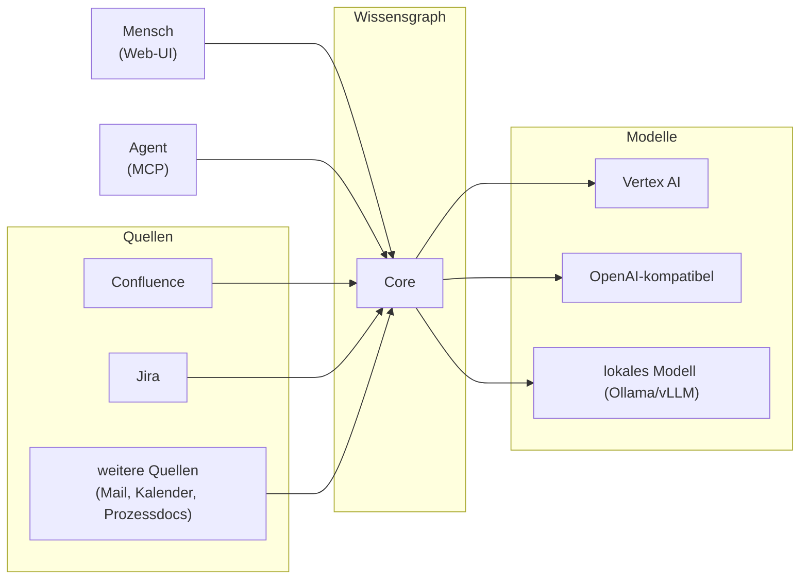
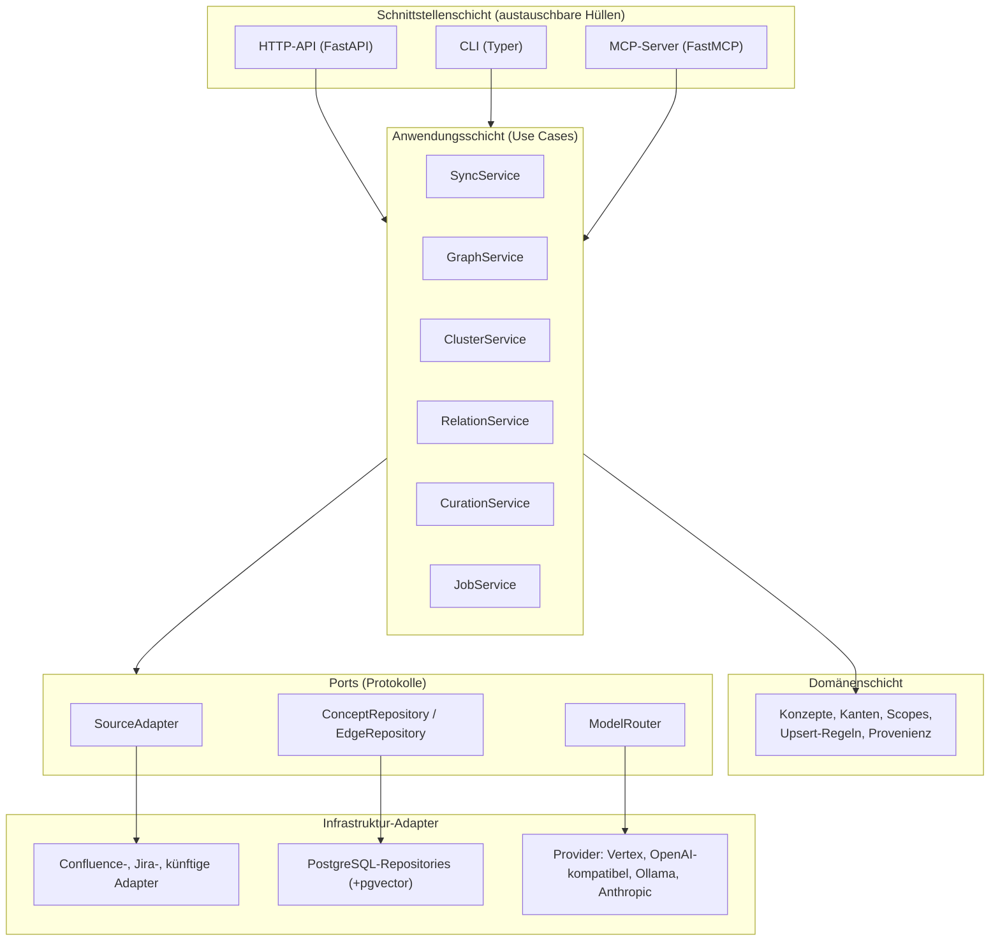
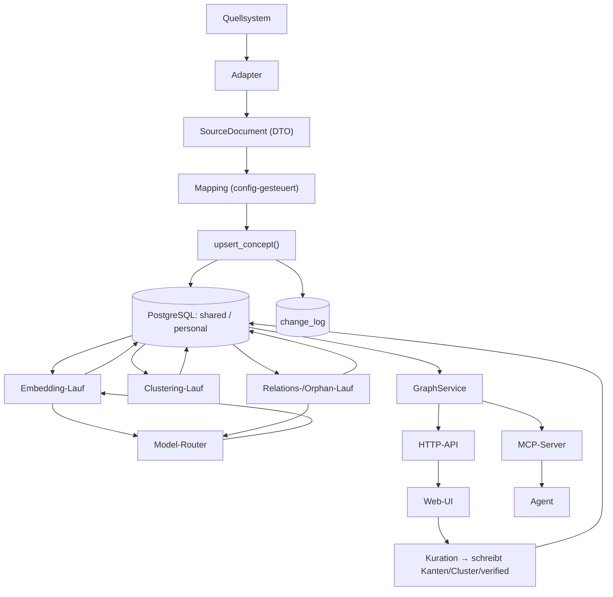
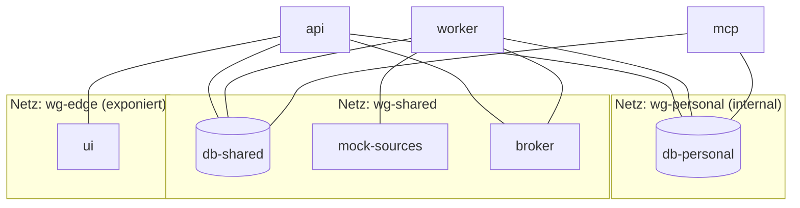
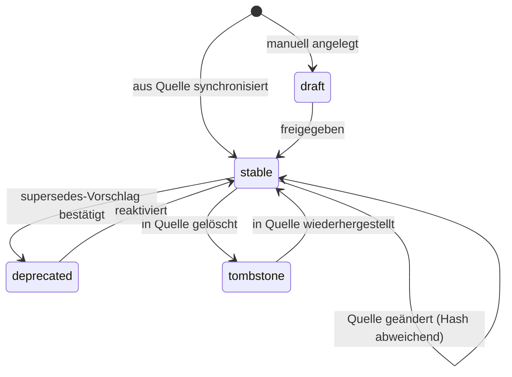
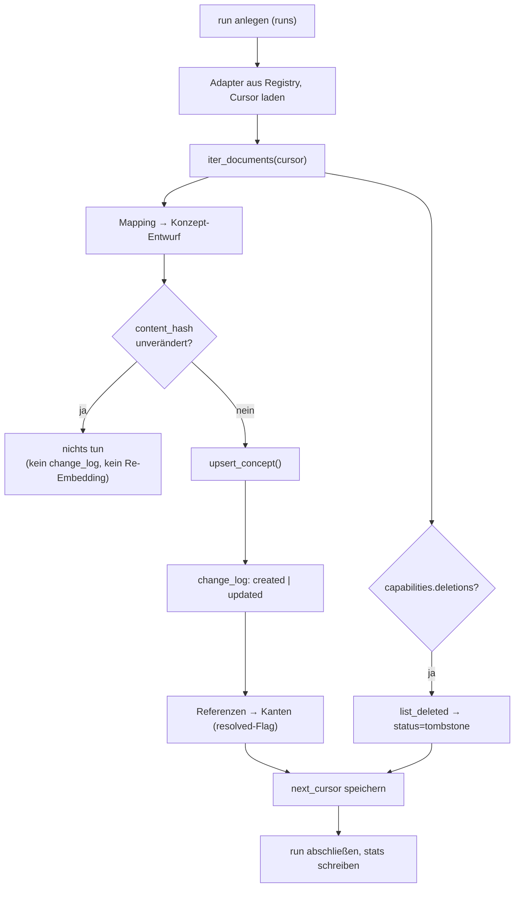
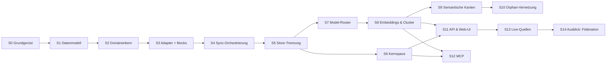

# Wissensgraph — Architektur- und Spezifikationsdokument

**Dokumenttyp:** Architektur- und Implementierungsspezifikation
**Status:** verbindliche Grundlage für die Implementierung
**Version:** 2.0 (Stand 30. August 2026)
**Ersetzt:** `architektur-zielbild-wissensgraph.md` (v1), `technisches-konzept-wissensgraph-poc.md`
**Vertiefendes Dokument:** `detailkonzept-embeddings-wissensgraph-poc.md` (Embedding-Details)

---

## Inhaltsverzeichnis

1. [Zweck, Zielbild und Geltungsbereich](#1-zweck-zielbild-und-geltungsbereich)
2. [Glossar](#2-glossar)
3. [Leitprinzipien](#3-leitprinzipien)
4. [Gesamtarchitektur](#4-gesamtarchitektur)
5. [Deployment- und Container-Architektur](#5-deployment--und-container-architektur)
6. [Konfigurationsmodell](#6-konfigurationsmodell)
7. [Datenmodell](#7-datenmodell)
8. [Quell-Adapter-Framework](#8-quell-adapter-framework)
9. [Mock-Quellen für die Entwicklung](#9-mock-quellen-für-die-entwicklung)
10. [Sync-Pipeline](#10-sync-pipeline)
11. [Model-Router](#11-model-router)
12. [Graph-Engine: Kernspace-Auflösung](#12-graph-engine-kernspace-auflösung)
13. [Embeddings und Clustering](#13-embeddings-und-clustering)
14. [Semantische Kantenerkennung](#14-semantische-kantenerkennung)
15. [Verwaiste-Knoten-Vernetzung](#15-verwaiste-knoten-vernetzung)
16. [HTTP-API-Spezifikation](#16-http-api-spezifikation)
17. [Web-UI-Spezifikation](#17-web-ui-spezifikation)
18. [MCP-Server-Spezifikation](#18-mcp-server-spezifikation)
19. [CLI-Spezifikation](#19-cli-spezifikation)
20. [Sicherheit, Scope-Trennung und Secrets](#20-sicherheit-scope-trennung-und-secrets)
21. [Observability und Fehlerbehandlung](#21-observability-und-fehlerbehandlung)
22. [Teststrategie](#22-teststrategie)
23. [Projektstruktur](#23-projektstruktur)
24. [Stufenplan](#24-stufenplan)
25. [Offene Punkte und Nicht-Ziele](#25-offene-punkte-und-nicht-ziele)

---

## 1. Zweck, Zielbild und Geltungsbereich

### 1.1 Zielbild

Am Ende steht ein System, in dem ein Agent und ein Mensch auf denselben Wissensgraphen zugreifen — der Agent über einen MCP-Server, der Mensch über eine Web-UI. Der Graph setzt sich aus zwei logisch und physisch getrennten Speicherbereichen zusammen:

- **personal** — die lokale Wissensbasis eines einzelnen Menschen. Verlässt den lokalen Rechner nicht.
- **shared** — geteiltes Wissen, unterteilt in Scopes (`global`, `finance`, `engineering`, …). Im POC ebenfalls lokal, architektonisch aber auf einen zentralen Betrieb vorbereitet.

Rohdaten aus angebundenen Quellen werden inkrementell synchronisiert und automatisch zu thematischen **Cluster-Konzepten** zusammengefasst. Der Agent bewegt sich bevorzugt entlang echter Kanten durch den Graphen; Volltext- und Vektorsuche sind Fallback, nicht Standardweg. Der Mensch kann über die UI das Ergebnis der automatischen Organisation korrigieren: Kanten setzen und entfernen, Cluster bilden und umsortieren, generierte Beziehungen bestätigen oder verwerfen.

### 1.2 Was diese Version gegenüber v1 ändert

| Bereich | v1 | v2 (dieses Dokument) |
|---|---|---|
| Datenhaltung | zwei SQLite-Dateien | PostgreSQL + `pgvector`, zwei getrennte Datenbanken, im Stack mit deployt |
| Modellzugriff | Vertex AI fest verdrahtet | **Model-Router** mit austauschbaren Providern und aufgabenbezogenem Routing |
| Quellanbindung | je ein Skript pro Quelle | **Adapter-Framework** mit festem Kontrakt und Registry; neue Quelle = neues Paket + Config-Eintrag |
| Entwicklung gegen Quellen | direkt gegen Confluence/Jira | **Mock-Quellserver** als Container; Umschalten auf echt per Config |
| UI | Marimo-Notebook | eigenständige **Web-UI** (SPA) gegen eine HTTP-API |
| Kuration | Nicht-Ziel (Phase 11) | **Teil des Kerns**: Reorganisation, Verlinkung und Cluster-Bildung durch den Menschen |
| Konfiguration | teils im Code | **vollständig aus ENV und Config-Dateien**, keine Hardcodierung |
| Betrieb | Container für die App | **gesamter Stack** in Containern, inkl. Datenbank, UI, Mock-Quellen |

### 1.3 Geltungsbereich

Dieses Dokument spezifiziert die Zielarchitektur und den stufenweisen Aufbau bis einschließlich einer produktionsnahen Einzelnutzer-Installation mit Kuration und Agentenanbindung. Die Föderation über mehrere Menschen hinweg ist als Ausbaustufe skizziert, aber nicht ausspezifiziert.

---

## 2. Glossar

| Begriff | Bedeutung |
|---|---|
| **Konzept** | Grundeinheit des Graphen: eine Zeile in `concepts`, strukturiert nach dem OKF-Feldschema (`type`, `title`, `description`, …) |
| **Kante** | gerichtete, typisierte Verbindung zwischen zwei Konzepten (`edges`); trägt Provenienz und Verifikationsstatus |
| **Store** | eine der beiden physischen Datenbanken: `personal` oder `shared` |
| **Scope** | logische Gruppierung innerhalb eines Stores (`global`, `finance`, `personal`); eine Spalte, kein Verzeichnis |
| **Kernspace** | der `personal`-Store als Ursprung jeder Traversierung |
| **Referenzdichte** | wie viele eigene Konzepte in der Nähe eines Zielkonzepts verlinken; bestimmt die gefühlte Relevanz aus eigener Perspektive |
| **Brücken-Konzept** | ein lokales Konzept (typisch `type: Project`), das explizit auf Konzepte in einem anderen Store/Scope verlinkt |
| **Cluster-Konzept** | generiertes Konzept (`type: Cluster`), das mehrere thematisch ähnliche Konzepte über `member`-Kanten bündelt |
| **Stabile ID** | Primärschlüssel eines Konzepts, quellabgeleitet (`confluence:184320`) oder generiert (`cluster:<uuid>`) |
| **Content-Hash** | SHA-256 über die inhaltstragenden Felder; erkennt Änderungen ohne teuren Vergleich |
| **Loser Knoten** | Konzept mit weniger als `loose_threshold` Nicht-`member`-Kanten |
| **Adapter** | Implementierung des Quell-Kontrakts für genau ein Quellsystem |
| **Model-Router** | zentrale Komponente, die aufgabenbezogen ein Sprach- oder Embedding-Modell auswählt, aufruft und protokolliert |
| **Task-Profil** | benannte Modellaufgabe (`embedding`, `relation_extraction`, …) mit eigener Routing-Regel |
| **Kuration** | menschliche Korrektur der automatisch erzeugten Struktur über die UI |
| **Provenienz** | Herkunftsangabe eines Datums: `generated_by` (wer/was), `generated_at` (wann), `verified` (von einem Menschen bestätigt) |

---

## 3. Leitprinzipien

Diese Prinzipien sind Entscheidungsgrundlage bei jeder Implementierungsfrage, die dieses Dokument nicht explizit beantwortet.

1. **Kernspace-Prinzip.** Der Graph wird immer vom `personal`-Store aus aufgelöst, nie als vorberechnete Gesamtsicht.
2. **Personal bleibt lokal.** Der `personal`-Store verlässt den lokalen Rechner nicht. Das gilt auch für Modellaufrufe: persönliche Inhalte gehen nur an Provider, die als lokal deklariert sind (§11.5).
3. **Sensitivität ist Speichertrennung.** Zugriff entscheidet sich über getrennte Datenbanken und getrennte Rollen, nicht über ein Feld.
4. **Quelle bleibt Quelle.** Abgeleitete Reorganisation verändert nie Inhalt oder Identität eines gespiegelten Konzepts. Cluster-Zuordnung ist eine zusätzliche Kante, kein Überschreiben.
5. **Kanonische Entität statt Duplikat.** Ein realer Sachverhalt existiert einmal im passenden Scope; persönliche Notizen verlinken darauf.
6. **Ehrliche Provenienz.** Maschinell Erzeugtes trägt `generated_by` und `verified = false`, bis ein Mensch draufgeschaut hat. Kein automatischer Schritt setzt `verified`.
7. **Traversierung statt Kontext-Dump.** Der Agent läuft den Graphen gezielt ab, statt vorgefertigten Kontext geliefert zu bekommen.
8. **Aufbau und Abfrage sind getrennte Pipelines.** Sync, Clustering und Vernetzung laufen unabhängig von den Lesewerkzeugen.
9. **Cluster sind die primäre Verbindungsstelle.** Lokale Konzepte verlinken bevorzugt auf Cluster, nicht auf rohe Einzeldokumente.
10. **Stabile ID statt Pfad.** Identität ist der Primärschlüssel. Reorganisation ist ein `INSERT`/`UPDATE` auf `edges`, keine Migration.
11. **OKF ist ein Feldschema, kein Dateiformat.** Übernommen wird das Konzept-Vokabular, nicht die Bundle-Form. Bewusste Abweichung mit dokumentierten Kosten (§7.8).
12. **Keine Hardcodierung.** Jeder Wert, der sich zwischen Umgebungen, Installationen oder Läufen unterscheiden kann, kommt aus ENV oder Config. Im Code stehen nur Defaults, und die stehen an genau einer Stelle (§6).
13. **Austauschbarkeit an den Rändern.** Quellsysteme und Modelle sind über Kontrakte angebunden. Ein Wechsel dahinter ändert keine Kernlogik.
14. **API-first.** Jede Funktion, die die UI braucht, existiert zuerst als API-Endpunkt und darunter als aufrufbare Python-Funktion. UI, CLI und MCP sind drei dünne Hüllen um denselben Kern.
15. **Mensch schlägt Maschine.** Kuratierte Kanten und Zuordnungen werden von automatischen Läufen nie überschrieben oder gelöscht (§13.4).

---

## 4. Gesamtarchitektur

### 4.1 Systemkontext



### 4.2 Schichtenmodell

Der Kern ist nach dem Ports-and-Adapters-Muster aufgebaut. Die Domänenschicht kennt weder HTTP noch SQL noch einen Modellanbieter.



**Regel:** Ein Import von `infrastructure` nach `domain` ist verboten und wird per Lint-Regel (`import-linter`) erzwungen. Diese Regel ist der technische Ausdruck von Leitprinzip 13.

### 4.3 Datenflüsse



Aufbau-Pipelines (Sync, Embedding, Clustering, Relation, Orphan) und Abfragepfade (GraphService) teilen sich nur die Datenbank. Kein Abfragepfad triggert implizit einen Aufbauschritt.

---

## 5. Deployment- und Container-Architektur

### 5.1 Services

Der gesamte Stack wird über eine `docker-compose.yml` gestartet. Kein Service setzt eine Installation auf dem Host voraus außer Docker selbst.

| Service | Image/Basis | Aufgabe | Host → Container (Default, konfigurierbar) |
|---|---|---|---|
| `db-shared` | `pgvector/pgvector:pg16` | PostgreSQL für den `shared`-Store | 5433 → 5432 |
| `db-personal` | `pgvector/pgvector:pg16` | PostgreSQL für den `personal`-Store | **keine Freigabe** (§5.2) |
| `api` | Projekt-Image (Python/uv) | HTTP-API, Kern-Services | 8080 → 8080 |
| `worker` | dasselbe Image, anderer Befehl | asynchrone Läufe (Sync, Embedding, Clustering, Orphan) | — |
| `mcp` | dasselbe Image, anderer Befehl | FastMCP-Server für den Agenten | 8800 → 8800 |
| `ui` | Node-Build → nginx | Auslieferung der SPA | 5173 → 80 |
| `mock-sources` | Projekt-Image, anderer Befehl | HTTP-Mocks für Confluence und Jira | 8090 → 8090 |
| `broker` | `redis:7-alpine` | Job-Queue und Ergebnis-Backend | **keine Freigabe** |

Zwei Dienste erscheinen bewusst **ohne** Host-Freigabe. Bei `db-personal` ist das die
Ausformung von §5.2 und §20.1: Das Netz `wg-personal` ist `internal`, eine Freigabe wäre dort
ohnehin wirkungslos — und der Verzicht macht die Absicht sichtbar. Werkzeuge gegen diesen Store
laufen deshalb im Container (§19), nicht auf dem Host. Der Broker wird von außen nicht
gebraucht; wer ihn ansieht, tut das über `docker compose exec`.

**Zwei Datenbank-Services statt zwei Datenbanken in einem Service** ist eine bewusste Entscheidung: Sie macht die Trennung im Deployment sichtbar, erlaubt getrennte Netzwerke und macht den späteren Umzug des `shared`-Stores auf einen zentralen Server zu einer reinen Konfigurationsänderung.

### 5.2 Netzwerksegmentierung



- `db-personal` liegt in einem als `internal: true` markierten Docker-Netz. Von dort ist kein ausgehender Verkehr möglich.
- Nur `api`, `worker` und `mcp` haben Zugang zu beiden Datenbanknetzen.
- `ui` erreicht ausschließlich `api`.

### 5.3 Persistenz

| Pfad | Inhalt | Art |
|---|---|---|
| `./data/pg-personal` | Datenverzeichnis `db-personal` | Bind-Mount (bewusst sichtbar auf dem Host) |
| `./data/pg-shared` | Datenverzeichnis `db-shared` | Bind-Mount |
| `./config` | Config-Dateien, read-only in die Container gemountet | Bind-Mount, `:ro` |
| `./secrets` | Credential-Dateien (z. B. GCP-Key), read-only | Bind-Mount, `:ro`, in `.gitignore` |
| `./fixtures` | Seed-Daten der Mock-Quellen | Bind-Mount, `:ro` |
| `./var/exports` | optionale OKF-Exporte | Bind-Mount |

### 5.4 Profile

`docker compose --profile <name> up` steuert, was läuft:

| Profil | Enthaltene Services | Zweck |
|---|---|---|
| `dev` | alle inkl. `mock-sources` | lokale Entwicklung gegen Mocks |
| `live` | alle außer `mock-sources` | Betrieb gegen echte Quellsysteme |
| `minimal` | `db-*`, `api`, `ui` | UI-Arbeit ohne Hintergrundläufe |
| `test` | `db-*`, `mock-sources` | Integrationstests in CI |

### 5.5 Start-Verhalten

1. `db-shared` und `db-personal` starten, Healthcheck über `pg_isready`.
2. `api` wartet auf beide Healthchecks, führt Migrationen aus (`alembic upgrade head` je Store) und startet erst dann den Server.
3. `worker` und `mcp` warten auf den `/readyz`-Healthcheck von `api`.
4. `ui` startet unabhängig, zeigt bis zur API-Verfügbarkeit einen Verbindungshinweis.

Migrationen laufen ausschließlich im `api`-Service, nie parallel in mehreren Containern. Absicherung über einen PostgreSQL-Advisory-Lock.

---

## 6. Konfigurationsmodell

### 6.1 Grundregeln

1. Im Code steht kein Literal, das eine Umgebung, ein Modell, eine URL, eine Schwelle oder einen Scope-Namen benennt. Ausnahme: die zentrale Defaults-Definition in `config/defaults.py`.
2. Secrets stehen nie in einer Config-Datei im Repository. Sie kommen aus ENV oder aus Dateien unter `./secrets`.
3. Config-Dateien dürfen ENV-Platzhalter enthalten (`${WG_...}`). Nicht auflösbare Platzhalter sind ein Startfehler, kein leerer String.
4. Die vollständig aufgelöste Konfiguration wird beim Start einmal validiert (Pydantic) und dann unveränderlich gehalten.
5. `GET /api/v1/config/effective` liefert die aufgelöste Konfiguration mit maskierten Secrets — damit ist jederzeit überprüfbar, womit ein Container tatsächlich läuft.

### 6.2 Präzedenz

Von niedrig nach hoch:

```
Code-Defaults  <  config/*.yaml  <  .env-Datei  <  Prozess-ENV  <  CLI-Flag / API-Parameter
```

Laufbezogene Parameter (Schwellen, Limits) sind auf allen Ebenen überschreibbar. Strukturelle Werte (DSNs, Provider-Credentials) nur bis Ebene ENV.

### 6.3 Config-Dateien

| Datei | Inhalt |
|---|---|
| `config/wissensgraph.yaml` | Kern: Scopes, Stores, Defaults für Läufe, Feature-Flags |
| `config/models.yaml` | Provider und Task-Profile des Model-Routers (§11) |
| `config/sources.yaml` | Adapter-Instanzen und deren Mapping-Regeln (§8) |
| `config/patterns/*.yaml` | Regex-Muster für den textbasierten Abgleich (§15.2) |
| `config/logging.yaml` | Log-Ausgabe, Level je Logger |

**Beispiel `config/wissensgraph.yaml`:**

```yaml
stores:
  shared:
    dsn: ${WG_DB_SHARED_DSN}
    allow_remote: true
  personal:
    dsn: ${WG_DB_PERSONAL_DSN}
    allow_remote: false          # Startfehler, wenn der DSN nicht lokal auflöst

scopes:
  - name: global
    store: shared
    description: unternehmensweit gültiges Wissen
  - name: finance
    store: shared
  - name: engineering
    store: shared
  - name: personal
    store: personal

concept_types:                    # Taxonomie ist Konfiguration, nicht Code
  - { name: "Confluence Page", stores: [shared], source_mirrored: true }
  - { name: "Jira Issue",      stores: [shared], source_mirrored: true }
  - { name: "Process",         stores: [shared], source_mirrored: true }
  - { name: "Cluster",         stores: [shared, personal], source_mirrored: false }
  - { name: "Project",         stores: [personal], source_mirrored: false }
  - { name: "Note",            stores: [personal], source_mirrored: false }

edge_kinds:
  structural: [member, related]
  semantic:   [depends_on, extends, supersedes, references, contradicts, implements]

clustering:
  neighbors_k: 8
  min_cluster_size: 3
  max_cluster_size: 25
  stability_runs: 2
  related_cluster_top_n: 3
  relabel_on_member_change_pct: 20

orphans:
  loose_threshold: 1
  proximity_top_n: 30
  proximity_auto_commit: 0.85
  proximity_candidate_band: 0.60
  use_llm: true
  cluster_suggestion_limit: 2
  cluster_preview_members: 15
  min_confidence: 0.60

traversal:
  default_hops: 2
  max_hops: 5
  max_nodes: 400
  ranking:
    hop_weight: 0.5
    density_weight: 0.3
    recency_weight: 0.2
    recency_half_life_days: 90

budget:
  max_model_calls_per_run: 2000
  max_estimated_cost_per_run_eur: 5.0
  on_exceed: abort            # abort | warn
```

### 6.4 Umgebungsvariablen

Alle Variablen tragen das Präfix `WG_`. Verschachtelung über `__`.

| Variable | Pflicht | Default | Bedeutung |
|---|---|---|---|
| `WG_ENV` | nein | `dev` | `dev` \| `test` \| `prod` |
| `WG_CONFIG_DIR` | nein | `/app/config` | Verzeichnis der Config-Dateien |
| `WG_LOG_LEVEL` | nein | `INFO` | Log-Level |
| `WG_LOG_FORMAT` | nein | `json` | `json` \| `console` |
| `WG_DB_SHARED_DSN` | ja | — | `postgresql+psycopg://user:pw@db-shared:5432/wg_shared` |
| `WG_DB_PERSONAL_DSN` | ja | — | DSN des personal-Stores |
| `WG_DB_POOL_SIZE` | nein | `5` | Connection-Pool je Store |
| `WG_EMBEDDING_DIM` | ja | — | Vektordimension; bestimmt das Migrationsschema (§7.3) |
| `WG_API_HOST` / `WG_API_PORT` | nein | `0.0.0.0` / `8080` | Bind-Adresse der API |
| `WG_API_AUTH_MODE` | nein | `token` | `none` \| `token` \| `oidc` |
| `WG_API_TOKEN` | bedingt | — | Bearer-Token bei `auth_mode=token` |
| `WG_API_CORS_ORIGINS` | nein | `http://localhost:5173` | kommaseparierte Liste |
| `WG_UI_API_BASE_URL` | ja (UI) | — | zur Build- oder Laufzeit in die SPA injiziert |
| `WG_MCP_TRANSPORT` | nein | `http` | `stdio` \| `http` |
| `WG_MCP_HOST` / `WG_MCP_PORT` | nein | `127.0.0.1` / `8800` | Bind-Adresse des MCP-Servers im Container |
| `WG_MCP_PATH` | nein | `/mcp` | Pfad des Streamable-HTTP-Endpunkts |
| `WG_MCP_HOST_BIND` / `WG_MCP_HOST_PORT` | nein | `0.0.0.0` / `8800` | Wohin Docker den Port auf dem Host bindet. Auf einem im Netz erreichbaren Rechner gehört dort `127.0.0.1` hin: Der Endpunkt kennt keine Authentifizierung (§18.3). |
| `WG_BROKER_URL` | ja | — | Redis-URL für die Job-Queue |
| `WG_MODELS_FILE` | nein | `${WG_CONFIG_DIR}/models.yaml` | Pfad zur Router-Konfiguration |
| `WG_SOURCES_FILE` | nein | `${WG_CONFIG_DIR}/sources.yaml` | Pfad zur Quell-Konfiguration |
| `WG_PERSONAL_ALLOW_REMOTE_MODELS` | nein | `false` | Freigabe, persönliche Inhalte an nicht-lokale Provider zu senden |
| `WG_PROVIDER_VERTEX__PROJECT` | bedingt | — | GCP-Projekt |
| `WG_PROVIDER_VERTEX__LOCATION` | bedingt | `europe-west4` | Region |
| `WG_PROVIDER_VERTEX__CREDENTIALS_FILE` | bedingt | — | Pfad zum Service-Account-Key unter `/secrets` |
| `WG_PROVIDER_OPENAI__BASE_URL` | bedingt | — | Basis-URL OpenAI-kompatibler Endpunkt |
| `WG_PROVIDER_OPENAI__API_KEY` | bedingt | — | API-Key |
| `WG_PROVIDER_OLLAMA__BASE_URL` | bedingt | `http://host.docker.internal:11434` | lokaler Modellserver |
| `WG_SOURCE_CONFLUENCE__BASE_URL` | bedingt | — | Mock- oder Live-URL |
| `WG_SOURCE_CONFLUENCE__TOKEN` | bedingt | — | API-Token |
| `WG_SOURCE_JIRA__BASE_URL` | bedingt | — | Mock- oder Live-URL |
| `WG_SOURCE_JIRA__TOKEN` | bedingt | — | API-Token |

**Umschalten von Mock auf Live** ist genau eine Änderung: `WG_SOURCE_CONFLUENCE__BASE_URL` zeigt statt auf `http://mock-sources:8090/confluence` auf die echte Instanz, plus ein gültiges Token. Kein Codepfad kennt den Unterschied.

### 6.5 Validierung beim Start

Der Startvorgang bricht mit klarer Fehlermeldung ab, wenn:

- ein Pflichtwert fehlt oder ein Platzhalter nicht auflösbar ist,
- `stores.personal.allow_remote = false`, der DSN aber nicht auf `localhost`, eine private Adresse oder den bekannten Compose-Service zeigt,
- ein in `scopes` referenzierter Store nicht existiert,
- ein Task-Profil im Router auf einen unbekannten Provider verweist,
- `WG_EMBEDDING_DIM` von der Dimension abweicht, mit der die Datenbank migriert wurde,
- ein Adapter in `sources.yaml` nicht in der Registry auffindbar ist.

---

## 7. Datenmodell

### 7.1 OKF-Feldschema

| Feld | Pflicht | Verwendung |
|---|---|---|
| `type` | ja | Konzept-Typ aus der konfigurierten Taxonomie |
| `title` | empfohlen | Anzeigename, Embedding-Input |
| `description` | empfohlen | Kurzsummary, Embedding-Input, Grundlage für Modell-Aufrufe |
| `body` | optional | Freitext/Markdown; Referenzen auf andere Konzepte als `[[id]]` |
| `resource` | optional | URL zur Quelle |
| `tags` | optional | freie Verschlagwortung |
| `audience` | optional (Erweiterung) | `role:`/`team:`-Werte für spätere Ambient-Filterung — **kein Zugriffsschutz** |
| `status` | optional | `draft` \| `stable` \| `deprecated` \| `tombstone` |
| `stale_after` | optional | Verfallszeitpunkt |
| `generated_by` / `generated_at` | bei Generiertem Pflicht | Provenienz |
| `verified_by` / `verified_at` | optional | gesetzt ausschließlich durch Kuration |
| `content_hash` | intern | SHA-256 über `title` + `description` + `body` |

### 7.2 Typen-Taxonomie

| `type` | Bedeutung | Store | quellgespiegelt |
|---|---|---|---|
| `Confluence Page` | 1:1-Spiegelung einer Seite | shared | ja |
| `Jira Issue` | 1:1-Spiegelung eines Issues | shared | ja |
| `Process` | globales Prozessdokument | shared | ja |
| `Cluster` | generierte oder kuratierte semantische Gruppierung | shared, personal | nein |
| `Project` | Brücken-Konzept zwischen Kernspace und anderem Scope | personal | nein |
| `Note` | freie persönliche Notiz | personal | nein |

`source_mirrored: true` bedeutet: Inhaltsfelder sind für UI, API und Agent schreibgeschützt. Kuration darf an solchen Konzepten nur Kanten, `status`, `tags` und Verifikationsfelder ändern (§17.5).

Eine neue Quelle bringt einen neuen `type`-Wert plus Adapter mit. Das Schema ändert sich dafür nicht.

### 7.3 Physische Struktur

Zwei PostgreSQL-Datenbanken mit identischem Schema, verwaltet über getrennte Alembic-Versionstabellen:

```
db-shared   → Datenbank wg_shared    (Scopes: global, finance, engineering, …)
db-personal → Datenbank wg_personal  (Scope: personal)
```

Erweiterungen je Datenbank: `vector` (pgvector), `pg_trgm` (Trigramm-Suche für den lexikalischen Fallback), `uuid-ossp`.

**Warum keine Fremdschlüssel über Store-Grenzen:** Ein Brücken-Konzept in `personal` verweist per Kante auf ein Konzept in `shared`. Ein datenbankweiter Fremdschlüssel ist dafür technisch unmöglich. Kanten führen deshalb explizit den Zielstore mit und werden auf Anwendungsebene aufgelöst. Das ist die zentrale Modellierungsentscheidung, die aus der Store-Trennung folgt.

### 7.4 DDL

```sql
-- ============ concepts ============
CREATE TABLE concepts (
    id             TEXT PRIMARY KEY,              -- 'confluence:184320', 'cluster:<uuid>', 'note:<uuid>'
    store          TEXT NOT NULL,                 -- 'shared' | 'personal' (redundant, aber explizit)
    scope          TEXT NOT NULL,
    type           TEXT NOT NULL,
    title          TEXT,
    description    TEXT,
    body           TEXT,
    resource       TEXT,
    tags           JSONB NOT NULL DEFAULT '[]'::jsonb,
    audience       JSONB NOT NULL DEFAULT '[]'::jsonb,
    status         TEXT NOT NULL DEFAULT 'stable',
    stale_after    TIMESTAMPTZ,
    content_hash   TEXT,
    source_name    TEXT,                          -- NULL bei lokal erzeugten Konzepten
    external_id    TEXT,                          -- ID im Quellsystem
    source_updated_at TIMESTAMPTZ,                -- Änderungszeit laut Quelle
    generated_by   TEXT,
    generated_at   TIMESTAMPTZ,
    verified_by    TEXT,
    verified_at    TIMESTAMPTZ,
    curated        BOOLEAN NOT NULL DEFAULT FALSE, -- von Hand angelegt oder verändert
    created_at     TIMESTAMPTZ NOT NULL DEFAULT now(),
    updated_at     TIMESTAMPTZ NOT NULL DEFAULT now(),
    search_tsv     tsvector GENERATED ALWAYS AS (
                       to_tsvector('simple',
                         coalesce(title,'') || ' ' || coalesce(description,'') || ' ' || coalesce(body,''))
                   ) STORED
);

CREATE UNIQUE INDEX ux_concepts_source ON concepts (source_name, external_id)
    WHERE source_name IS NOT NULL;
CREATE INDEX ix_concepts_scope_type ON concepts (scope, type);
CREATE INDEX ix_concepts_status     ON concepts (status);
CREATE INDEX ix_concepts_tsv        ON concepts USING GIN (search_tsv);
CREATE INDEX ix_concepts_title_trgm ON concepts USING GIN (title gin_trgm_ops);

-- ============ edges ============
CREATE TABLE edges (
    id            UUID PRIMARY KEY DEFAULT uuid_generate_v4(),
    from_store    TEXT NOT NULL,
    from_id       TEXT NOT NULL,
    to_store      TEXT NOT NULL,
    to_id         TEXT NOT NULL,
    kind          TEXT NOT NULL DEFAULT 'member',
    weight        DOUBLE PRECISION,               -- z. B. Kosinus-Ähnlichkeit
    confidence    DOUBLE PRECISION,               -- Modell-Confidence, NULL bei Code/Mensch
    reasoning     TEXT,                           -- ein Satz Begründung des Modells
    resolved      BOOLEAN NOT NULL DEFAULT FALSE, -- Zielkonzept existiert und ist auffindbar
    generated_by  TEXT,                           -- NULL = manuell gesetzt
    generated_at  TIMESTAMPTZ,
    verified_by   TEXT,
    verified_at   TIMESTAMPTZ,
    curated       BOOLEAN NOT NULL DEFAULT FALSE, -- von Hand gesetzt oder bestätigt
    created_at    TIMESTAMPTZ NOT NULL DEFAULT now(),
    CONSTRAINT ck_edges_no_self CHECK (NOT (from_store = to_store AND from_id = to_id))
);

CREATE UNIQUE INDEX ux_edges_triple ON edges (from_store, from_id, to_store, to_id, kind);
CREATE INDEX ix_edges_from ON edges (from_store, from_id, kind);
CREATE INDEX ix_edges_to   ON edges (to_store, to_id, kind);

-- Invariante im shared-Store (per Migration nur dort angelegt):
-- ALTER TABLE edges ADD CONSTRAINT ck_shared_no_personal_ref
--   CHECK (from_store = 'shared' AND to_store = 'shared');

-- ============ embeddings ============
-- Dimension stammt aus WG_EMBEDDING_DIM und wird in die Migration eingesetzt.
CREATE TABLE concept_embeddings (
    concept_id     TEXT NOT NULL REFERENCES concepts(id) ON DELETE CASCADE,
    model_key      TEXT NOT NULL,                 -- 'vertex:text-embedding-005'
    dim            INTEGER NOT NULL,
    embedding      vector(:embedding_dim) NOT NULL,
    source_hash    TEXT NOT NULL,                 -- content_hash zum Zeitpunkt des Embeddings
    created_at     TIMESTAMPTZ NOT NULL DEFAULT now(),
    PRIMARY KEY (concept_id, model_key)
);

CREATE INDEX ix_emb_hnsw ON concept_embeddings
    USING hnsw (embedding vector_cosine_ops) WITH (m = 16, ef_construction = 64);

-- ============ Cluster-Zentroide ============
CREATE TABLE cluster_centroids (
    cluster_id     TEXT PRIMARY KEY REFERENCES concepts(id) ON DELETE CASCADE,
    model_key      TEXT NOT NULL,
    embedding      vector(:embedding_dim) NOT NULL,
    member_count   INTEGER NOT NULL,
    updated_at     TIMESTAMPTZ NOT NULL DEFAULT now()
);

-- ============ Cluster-Zuordnungskandidaten (Stabilitätsschwelle) ============
CREATE TABLE cluster_assignment_candidates (
    concept_id     TEXT NOT NULL,
    cluster_id     TEXT NOT NULL,
    score          DOUBLE PRECISION NOT NULL,
    seen_count     INTEGER NOT NULL DEFAULT 1,
    first_seen_run UUID NOT NULL,
    last_seen_run  UUID NOT NULL,
    last_seen_at   TIMESTAMPTZ NOT NULL DEFAULT now(),
    PRIMARY KEY (concept_id, cluster_id)
);

-- ============ Änderungsjournal ============
CREATE TABLE change_log (
    id            BIGSERIAL PRIMARY KEY,
    concept_id    TEXT,
    edge_id       UUID,
    changed_at    TIMESTAMPTZ NOT NULL DEFAULT now(),
    change_type   TEXT NOT NULL,   -- created | updated | source_deleted | cluster_assigned |
                                   -- cluster_removed | edge_added | edge_removed | verified |
                                   -- rejected | status_changed | merged
    actor         TEXT NOT NULL,   -- 'system:sync', 'system:cluster', 'user:<id>', 'agent:<id>'
    run_id        UUID,
    detail        JSONB
);

CREATE INDEX ix_changelog_concept ON change_log (concept_id, changed_at DESC);
CREATE INDEX ix_changelog_run     ON change_log (run_id);

-- ============ Läufe ============
CREATE TABLE runs (
    id             UUID PRIMARY KEY,
    kind           TEXT NOT NULL,   -- sync | embed | cluster | relations | link_orphans | export
    params         JSONB NOT NULL DEFAULT '{}'::jsonb,
    status         TEXT NOT NULL,   -- queued | running | succeeded | failed | cancelled
    started_at     TIMESTAMPTZ,
    finished_at    TIMESTAMPTZ,
    progress       DOUBLE PRECISION NOT NULL DEFAULT 0,
    stats          JSONB NOT NULL DEFAULT '{}'::jsonb,
    error          TEXT
);

-- ============ Quell-Cursor ============
CREATE TABLE source_cursors (
    source_name    TEXT PRIMARY KEY,
    cursor         JSONB NOT NULL,
    last_full_sync TIMESTAMPTZ,
    updated_at     TIMESTAMPTZ NOT NULL DEFAULT now()
);

-- ============ Modellaufrufe (Kosten, Provenienz, Debugging) ============
CREATE TABLE model_calls (
    id             BIGSERIAL PRIMARY KEY,
    run_id         UUID,
    task           TEXT NOT NULL,
    provider       TEXT NOT NULL,
    model          TEXT NOT NULL,
    store          TEXT,                 -- Herkunft der verarbeiteten Inhalte
    tokens_in      INTEGER,
    tokens_out     INTEGER,
    latency_ms     INTEGER,
    cost_estimate  NUMERIC(10,5),
    cache_hit      BOOLEAN NOT NULL DEFAULT FALSE,
    attempt        INTEGER NOT NULL DEFAULT 1,
    status         TEXT NOT NULL,        -- ok | invalid_output | error | budget_denied
    created_at     TIMESTAMPTZ NOT NULL DEFAULT now()
);

-- ============ Sicht: lose Knoten ============
CREATE VIEW v_loose_concepts AS
SELECT c.id, c.scope, c.type, c.title,
       count(e.id) FILTER (WHERE e.kind <> 'member') AS semantic_degree
FROM concepts c
LEFT JOIN edges e
  ON (e.from_id = c.id AND e.from_store = c.store)
  OR (e.to_id   = c.id AND e.to_store   = c.store)
WHERE c.status <> 'tombstone'
GROUP BY c.id, c.scope, c.type, c.title;
```

### 7.5 ID-Konvention

| Muster | Beispiel | Erzeuger |
|---|---|---|
| `<source>:<external_id>` | `confluence:184320`, `jira:PROJ-123` | Adapter |
| `cluster:<uuid4>` | `cluster:3f2a…` | Clustering, Kuration |
| `note:<uuid4>` | `note:9b7c…` | Agent, UI |
| `project:<slug>` | `project:finance-integration` | Mensch |

Das Quellpräfix stammt aus `sources.yaml` (`id_prefix`), nicht aus dem Code. Eine ID ist unveränderlich; wird ein Quellobjekt umbenannt, bleibt die ID gleich.

### 7.6 Konzept-Lebenszyklus



**Löschung in der Quelle** führt nie zu einem `DELETE`. Das Konzept erhält `status = 'tombstone'`, Inhaltsfelder bleiben erhalten, Kanten bleiben bestehen und werden als `resolved = false` markiert. Damit bleiben persönliche Notizen, die darauf verlinkt haben, nachvollziehbar — der wichtigste Grund gegen echtes Löschen. Ein Aufräumlauf für Tombstones jenseits einer konfigurierten Aufbewahrungsfrist ist offener Punkt.

### 7.7 Kanten-Semantik

| `kind` | Bedeutung | Richtung | Erzeuger |
|---|---|---|---|
| `member` | Zugehörigkeit zu einem Cluster | Cluster → Mitglied | Clustering, Kuration |
| `related` | thematische Nähe | symmetrisch (beide Richtungen gespeichert) | Clustering, Proximity |
| `references` | erwähnt/verweist auf | gerichtet | Text-Match, Modell, Mensch |
| `depends_on` | benötigt | gerichtet | Modell, Mensch |
| `extends` | erweitert | gerichtet | Modell, Mensch |
| `supersedes` | löst ab | gerichtet | Modell, Mensch |
| `contradicts` | widerspricht | symmetrisch | Modell, Mensch |
| `implements` | setzt um | gerichtet | Modell, Mensch |

Die Liste steht in `config/wissensgraph.yaml` unter `edge_kinds` und ist erweiterbar, ohne Code zu ändern. Die Unterscheidung `structural` vs. `semantic` steuert das Traversierungsverhalten (abwärts vs. seitwärts) und die Definition eines losen Knotens.

### 7.8 Bewusster Verzicht

Die Wissensbasis ist damit **kein OKF-Dateibundle im Sinne der Spec**. Übernommen ist das Feldvokabular, nicht die Verzeichnisform. Verloren gehen: Git-native Historie und Diffs, direktes Editieren mit gewöhnlichen Werkzeugen, und die Lesbarkeit durch fremde OKF-Konsumenten ohne API. Gegenüber v1 kompensieren `change_log` (Historie), die Web-UI (Editieren) und die HTTP-API (Fremdzugriff) diese Punkte weitgehend. Ein Export-Lauf nach echten `.md`-Bundles hält die Tür zusätzlich offen (§25).

---

## 8. Quell-Adapter-Framework

### 8.1 Anforderung

Eine neue Quelle wird eingebunden, ohne Kernlogik zu ändern. Konkret heißt das: keine Änderung an `SyncService`, an den Repositories, am Datenmodell oder an der UI. Was ein Entwickler beisteuert, ist eine Klasse, die einen Kontrakt erfüllt, plus ein Eintrag in `sources.yaml`.

### 8.2 Kontrakt

```python
from typing import Protocol, Iterator, Sequence
from datetime import datetime
from pydantic import BaseModel


class SourceDocument(BaseModel):
    """Quellneutrale Darstellung eines einzelnen Objekts."""

    external_id: str
    title: str | None = None
    description: str | None = None
    body: str | None = None
    resource: str | None = None
    tags: Sequence[str] = ()
    updated_at: datetime | None = None
    type_hint: str | None = None  # überschreibt das Default-Mapping
    references: Sequence[str] = ()  # externe IDs, auf die dieses Objekt verweist
    extra: dict = {}  # quellspezifisch, wird nicht interpretiert


class Cursor(BaseModel):
    """Opake, adapterdefinierte Fortschrittsmarke. Wird als JSONB persistiert."""

    value: dict = {}


class AdapterCapabilities(BaseModel):
    incremental: bool = False  # unterstützt Cursor-basierten Teilabgleich
    deletions: bool = False  # kann gelöschte Objekte melden
    single_fetch: bool = False  # kann ein Einzelobjekt gezielt holen
    references: bool = False  # liefert ausgehende Referenzen mit


class SourceAdapter(Protocol):
    name: str  # 'confluence', 'jira', …
    capabilities: AdapterCapabilities

    def configure(self, cfg: "SourceConfig") -> None: ...
    def health(self) -> "HealthStatus": ...
    def iter_documents(self, cursor: Cursor | None) -> Iterator[SourceDocument]: ...
    def next_cursor(self) -> Cursor: ...
    def list_deleted(self, cursor: Cursor | None) -> Iterator[str]: ...
    def fetch(self, external_id: str) -> SourceDocument | None: ...
```

**Verpflichtende Eigenschaften jeder Implementierung:**

1. `iter_documents` ist ein Generator und lädt nie den gesamten Bestand in den Speicher.
2. Der Adapter kennt weder `concepts` noch SQL noch Scopes. Er liefert DTOs.
3. Fehlt eine Fähigkeit, ist das Flag `false` und die Methode wirft `NotSupported`. Der `SyncService` fragt Flags ab, nicht Ausnahmen.
4. Der Adapter ist idempotent: derselbe Cursor liefert dasselbe Ergebnis.
5. Rate-Limits und Retries behandelt der Adapter selbst, mit Werten aus seiner Config.

### 8.3 Registrierung

Zwei Wege, beide ohne Kernänderung:

1. **Entry Point** — ein installiertes Paket meldet unter der Gruppe `wissensgraph.adapters` eine Factory an.
2. **Modulpfad in der Config** — `class: "wissensgraph_confluence.adapter:ConfluenceAdapter"` in `sources.yaml`.

Die Registry lädt beim Start alle deklarierten Adapter, ruft `configure()` mit der aufgelösten Config auf und prüft `health()`. Ein fehlerhafter Adapter deaktiviert sich selbst und erscheint in der UI als `unhealthy`, ohne den Start zu verhindern.

### 8.4 Mapping-Konfiguration

Was aus einem `SourceDocument` ein Konzept macht, steht in der Config:

```yaml
# config/sources.yaml
sources:
  - name: confluence-eng
    adapter: confluence                  # Registry-Schlüssel
    enabled: true
    id_prefix: confluence
    target:
      store: shared
      scope: engineering
      default_type: "Confluence Page"
    connection:
      base_url: ${WG_SOURCE_CONFLUENCE__BASE_URL}
      token: ${WG_SOURCE_CONFLUENCE__TOKEN}
      timeout_seconds: 30
      rate_limit_per_second: 5
      retries: 3
    selection:
      spaces: ["ENG", "ARCH"]
      exclude_labels: ["archiv", "entwurf"]
    mapping:
      title:       "$.title"
      description: "$.excerpt"           # leer → wird per Task 'summarization' erzeugt
      body:        "$.body.storage.value"
      resource:    "$.links.webui"
      tags:        "$.metadata.labels[*].name"
    schedule:
      cron: "0 */6 * * *"
      enabled: false                     # im POC manuell ausgelöst

  - name: jira-team
    adapter: jira
    enabled: true
    id_prefix: jira
    target:
      store: shared
      scope: engineering
      default_type: "Jira Issue"
    connection:
      base_url: ${WG_SOURCE_JIRA__BASE_URL}
      token: ${WG_SOURCE_JIRA__TOKEN}
    selection:
      boards: ["TEAM"]
      jql_filter: "status != Closed OR updated >= -90d"
    mapping:
      title:       "$.fields.summary"
      description: "$.fields.description"
      resource:    "$.self"
      tags:        "$.fields.labels[*]"
```

Mehrere Instanzen desselben Adapters mit unterschiedlichen Zielen sind ausdrücklich vorgesehen (`confluence-eng`, `confluence-finance`).

### 8.5 Referenzauflösung

Ein Adapter liefert Referenzen als externe IDs. Der `SyncService` übersetzt sie über das Präfix der Quelle in interne IDs und schreibt Kanten mit `kind: references`, `generated_by: 'code:source-reference'`. Zeigt eine Referenz auf ein noch nicht synchronisiertes Objekt, wird die Kante mit `resolved = false` angelegt und bei jedem Lauf erneut geprüft. Kaputte Referenzen sind kein Fehler.

### 8.6 Checkliste für eine neue Quelle

1. Paket anlegen, `SourceAdapter` implementieren, Capabilities korrekt setzen.
2. Die generische Adapter-Contract-Testsuite (§22.3) gegen die Implementierung laufen lassen — sie ist Teil des Kerns und wird nicht kopiert.
3. Eintrag in `config/sources.yaml`, Credentials als ENV.
4. Optional: neuen `type`-Wert in `concept_types` ergänzen.
5. Fertig. Kein Kerncode wurde angefasst.

---

## 9. Mock-Quellen für die Entwicklung

### 9.1 Ansatz

Gemockt wird **nicht der Adapter, sondern das Quellsystem**. Der Service `mock-sources` stellt HTTP-Endpunkte bereit, die den relevanten Ausschnitten der Confluence- und Jira-REST-APIs entsprechen. Die echten Adapter laufen dagegen unverändert. Damit wird der komplette Codepfad inklusive Paginierung, Fehlerbehandlung und Rate-Limit-Logik in der Entwicklung tatsächlich ausgeführt — und der Wechsel auf die echte Quelle ist eine URL.

Zusätzlich existieren reine Fixture-Adapter (`fixture-source`) für schnelle Unit-Tests ohne Netzwerk. Sie sind kein Ersatz für den Mock-Server, sondern eine Ebene darunter.

### 9.2 Seed-Daten

```
fixtures/
├── confluence/
│   ├── spaces.json
│   ├── pages/*.json            # ~120 Seiten, drei erkennbare Themenfelder
│   └── links.json              # interne Verweise für die Referenzauflösung
├── jira/
│   ├── boards.json
│   └── issues/*.json           # ~80 Issues, teils mit Confluence-Verweisen im Text
└── scenarios/
    ├── incremental_update.json # markiert Objekte als geändert
    ├── deletion.json           # entfernt Objekte
    └── orphan.json             # isoliertes Konzept ohne thematische Nähe
```

Die Seed-Daten sind so gebaut, dass die fachlichen Tests darauf prüfbar sind: mindestens drei klar trennbare Cluster, mindestens ein Dokument, das thematisch zwischen zwei Clustern steht, mindestens ein bewusst isolierter Knoten, und mindestens ein Paar mit erkennbarer `depends_on`-Beziehung über Cluster-Grenzen hinweg.

### 9.3 Steuerungs-API des Mock-Servers

Zusätzlich zu den nachgebildeten Quell-Endpunkten:

| Endpunkt | Zweck |
|---|---|
| `POST /_control/reset` | Zurücksetzen auf den Seed-Zustand |
| `POST /_control/scenario/{name}` | Szenario anwenden (Änderung, Löschung, Neuanlage) |
| `POST /_control/latency` | künstliche Antwortzeit setzen |
| `POST /_control/fail` | Fehlerantworten erzwingen (429, 500, Timeout) |
| `GET /_control/state` | aktueller Zustand für Test-Assertions |

Damit sind inkrementeller Sync, Löschbehandlung, Retry-Verhalten und Rate-Limit-Handling automatisiert testbar — genau die Dinge, die man gegen ein Live-System nicht provozieren kann.

### 9.4 Umstellung auf echte Quellen

1. Compose-Profil `live` statt `dev`.
2. `WG_SOURCE_*__BASE_URL` und `__TOKEN` auf die echte Instanz setzen.
3. `GET /api/v1/sources` prüfen — jeder Adapter meldet `healthy`.
4. Erster Lauf mit `--dry-run`, Vergleich der gemeldeten Objektzahlen.
5. Vollständigen Sync starten.

Kein Code, kein Image, kein Schema ändert sich dabei.

---

## 10. Sync-Pipeline

### 10.1 Ablauf eines Laufs



### 10.2 Die Kernoperation

```python
def upsert_concept(draft: ConceptDraft, *, actor: str, run_id: UUID) -> UpsertResult:
    """
    Regeln:
      1. Identität ist die ID. Existiert sie, ist es ein UPDATE derselben Zeile.
      2. content_hash entscheidet, ob überhaupt geschrieben wird.
      3. Bei Gleichheit: kein UPDATE, kein change_log, kein Re-Embedding.
      4. Kuratierte Felder (curated=true) werden von der Quelle nicht überschrieben;
         der Konflikt landet als 'curation_conflict' im change_log.
      5. Der Aufruf ist transaktional: Konzept, Kanten und change_log gemeinsam.
    """
```

`UpsertResult` meldet `unchanged | created | updated | conflict` — die Grundlage der Lauf-Statistik.

### 10.3 Änderungserkennung — drei Ebenen

| Ebene | Frage | Mechanismus |
|---|---|---|
| Identität | Ist das dasselbe Objekt? | Primärschlüssel `id` |
| Inhalt | Hat sich etwas geändert? | `content_hash` (SHA-256 über `title`+`description`+`body`) |
| Frische | Ist es noch aktuell? | `source_updated_at`, `stale_after`, `change_log.changed_at` |

Der Hash spart die teuren Folgeschritte: kein Re-Embedding, kein erneuter Modellaufruf, kein Cluster-Neubewerten. Bei Quellen mit verlässlichem `updated_at` prüft der Adapter zusätzlich vorab und lädt den Body gar nicht erst.

### 10.4 Kuration versus Sync

Der zentrale Konflikt: Ein Mensch hat ein gespiegeltes Konzept mit Tags versehen oder auf `deprecated` gesetzt, dann ändert sich die Quelle.

| Feld | Bei Quelländerung |
|---|---|
| `title`, `description`, `body`, `resource` | Quelle gewinnt immer |
| `tags` | Vereinigung aus Quell-Tags und kuratierten Tags |
| `status` | Kuration gewinnt, außer die Quelle meldet Löschung |
| Kanten mit `curated = true` | bleiben unangetastet |
| Kanten mit `generated_by` | dürfen von Läufen ersetzt werden |
| `verified_*` | wird bei inhaltlicher Änderung zurückgesetzt, mit `change_log`-Eintrag |

Der letzte Punkt ist wichtig: Eine bestätigte Beziehung gilt für einen bestimmten Inhaltsstand. Ändert sich der Inhalt, ist die Bestätigung nicht mehr gedeckt.

### 10.5 Nebenläufigkeit

Pro Quelle läuft höchstens ein Sync gleichzeitig, abgesichert über einen PostgreSQL-Advisory-Lock auf dem Quellnamen. Ein zweiter Startversuch liefert `409 Conflict` mit der ID des laufenden Runs.

---

## 11. Model-Router

### 11.1 Zweck

Jeder Zugriff auf ein Sprach- oder Embedding-Modell läuft über genau eine Komponente. Kein Service kennt einen Anbieter, ein Modellnamen oder ein SDK. Damit ist ein Modellwechsel eine Änderung in `models.yaml` — inklusive: anderer Anbieter, lokales Modell statt Cloud, unterschiedliche Modelle je Aufgabe, unterschiedliche Modelle je Store.

### 11.2 Schnittstelle

```python
class ModelRouter(Protocol):
    def embed(
        self, task: str, texts: Sequence[str], *, store: str, run_id: UUID | None = None
    ) -> EmbeddingResult: ...

    def complete(
        self,
        task: str,
        *,
        prompt: PromptSpec,
        schema: type[BaseModel] | None = None,
        store: str,
        run_id: UUID | None = None,
    ) -> CompletionResult: ...

    def describe(self, task: str) -> ResolvedRoute: ...  # welches Modell würde greifen
```

`EmbeddingResult` trägt `vectors`, `model_key`, `dim`, `cached`, `usage`.
`CompletionResult` trägt `parsed` (validiertes Pydantic-Objekt), `raw`, `model_key`, `usage`, `attempts`.

Aufrufer nennen **nie ein Modell**, nur eine Aufgabe. Das ist die Regel, die den Router wirksam macht.

### 11.3 Task-Profile

| Task | Verwendet von | Anforderung |
|---|---|---|
| `embedding` | Embedding-Lauf, Vektorsuche | Dimension muss zur Migration passen |
| `cluster_labeling` | Clustering | kurzer Titel + Beschreibung aus Mitgliedstiteln |
| `relation_extraction` | Kantenerkennung (§14) | strikt strukturierte Ausgabe, Temperatur 0 |
| `cluster_matching` | Orphan-Lauf, Aufruf A (§15.3) | strukturierte Ausgabe, moderate Kontextlänge |
| `summarization` | fehlende `description` bei Quelldokumenten | günstig, hoher Durchsatz |
| `query_expansion` | optional bei `graph_search` | günstig, niedrige Latenz |

### 11.4 Konfiguration

```yaml
# config/models.yaml
providers:
  vertex:
    type: vertex
    project: ${WG_PROVIDER_VERTEX__PROJECT}
    location: ${WG_PROVIDER_VERTEX__LOCATION}
    credentials_file: ${WG_PROVIDER_VERTEX__CREDENTIALS_FILE}
    local: false
  openai_compat:
    type: openai_compatible
    base_url: ${WG_PROVIDER_OPENAI__BASE_URL}
    api_key: ${WG_PROVIDER_OPENAI__API_KEY}
    local: false
  ollama:
    type: openai_compatible
    base_url: ${WG_PROVIDER_OLLAMA__BASE_URL}
    api_key: "not-needed"
    local: true                      # entscheidend für die personal-Policy

defaults:
  timeout_seconds: 60
  max_retries: 3
  backoff: exponential
  cache: true
  cache_ttl_hours: 168

tasks:
  embedding:
    primary:  { provider: vertex, model: text-embedding-005, dim: 768, batch_size: 64 }
    fallback: [ { provider: ollama, model: nomic-embed-text, dim: 768 } ]
  cluster_labeling:
    primary:  { provider: vertex, model: gemini-2.5-flash, temperature: 0.2, max_tokens: 400 }
  relation_extraction:
    primary:  { provider: vertex, model: gemini-2.5-flash, temperature: 0.0, json_mode: true }
    fallback: [ { provider: openai_compat, model: gpt-4.1-mini, temperature: 0.0, json_mode: true } ]
  cluster_matching:
    primary:  { provider: vertex, model: gemini-2.5-pro, temperature: 0.0, json_mode: true }
  summarization:
    primary:  { provider: vertex, model: gemini-2.5-flash, temperature: 0.3, max_tokens: 200 }

policies:
  personal:
    allowed_providers: [ollama]      # persönliche Inhalte nur an lokale Modelle
    on_violation: abort              # abort | skip
  shared:
    allowed_providers: [vertex, openai_compat, ollama]
```

### 11.5 Store-Policy — die Datenschutzgrenze

Dies schließt eine Lücke der Vorversion: Wenn persönliche Notizen zum Einbetten an eine Cloud-API gehen, verlässt der Inhalt den Rechner, obwohl die Datenbank ihn nie verlassen hat.

**Regel:** Jeder Router-Aufruf trägt `store`. Der Router prüft gegen `policies.<store>.allowed_providers`. Ein Verstoß führt zu `ProviderNotAllowedError` und einem `model_calls`-Eintrag mit `status = 'budget_denied'` — nie zu einem stillen Fallback auf einen erlaubten, aber schlechteren Anbieter.

`WG_PERSONAL_ALLOW_REMOTE_MODELS=true` weicht die Regel bewusst und protokolliert auf. Default ist `false`.

**Konsequenz für den Betrieb:** Ohne lokalen Modellserver bleiben persönliche Konzepte ohne Embedding. Das ist kein Fehler, sondern der Preis von Leitprinzip 2 — der Kernspace funktioniert dann über Kanten und lexikalische Suche, nicht über Vektorähnlichkeit. Die UI zeigt diesen Zustand an.

### 11.6 Verhalten

| Aspekt | Regel |
|---|---|
| Fallback | erst nach erschöpften Retries des Primary; Wechsel wird protokolliert |
| Strukturierte Ausgabe | Antwort wird gegen das Pydantic-Schema validiert; bei Fehlschlag ein Reparaturversuch mit der Fehlermeldung, dann `invalid_output` |
| Caching | Schlüssel: SHA-256 über `task` + `model_key` + normalisierten Prompt/Text; Ablage in Redis; Treffer werden als `cache_hit` gezählt |
| Batching | Embeddings werden nach `batch_size` gebündelt; Teilfehler brechen nicht den ganzen Batch ab |
| Rate-Limits | Token-Bucket je Provider aus der Config |
| Budget | vor jedem Aufruf gegen `budget.max_model_calls_per_run` und `max_estimated_cost_per_run_eur` geprüft; bei `on_exceed: abort` endet der Lauf sauber mit Teilergebnis |
| Provenienz | jeder erzeugte Datensatz trägt `generated_by = "<provider>:<model>/<task>@v<router-version>"` |
| Determinismus | für `relation_extraction` und `cluster_matching` gilt `temperature = 0` als Pflichtwert; die Validierung lehnt andere Werte ab |

### 11.7 Modellwechsel im laufenden Betrieb

| Wechsel | Folge | Erforderlicher Schritt |
|---|---|---|
| Generatives Modell für eine Task | neue Kanten tragen andere Provenienz | keiner; alte Kanten bleiben gültig |
| Embedding-Modell, gleiche Dimension | Vektoren inkonsistent zwischen Modellen | `wg embed --rebuild`; Suche nutzt nur `model_key` des aktiven Profils |
| Embedding-Modell, andere Dimension | Vektorspalte passt nicht | neue Alembic-Migration mit neuer Dimension + vollständiger Neuaufbau |
| Provider für dieselbe Modellfamilie | — | keiner |

Der Router weigert sich zu starten, wenn `tasks.embedding.primary.dim` von `WG_EMBEDDING_DIM` abweicht. Vektorsuchen filtern immer auf den aktiven `model_key`; Mischbestände sind dadurch unschädlich.

---

## 12. Graph-Engine: Kernspace-Auflösung

### 12.1 Store-übergreifende Traversierung

Da `personal` und `shared` getrennte Datenbanken sind, gibt es keinen SQL-Join über die Grenze. Die Traversierung findet in der Anwendungsschicht statt:

```
1. Startknoten bestimmen (Store bekannt).
2. Kanten im Store des aktuellen Knotens laden.
3. Ziele nach Zielstore gruppieren.
4. Je Zielstore ein Batch-Load der Konzepte (ein Query pro Store und Hop).
5. Besuchte Knoten in einem Set führen (Schlüssel: store + id).
6. Bis max_hops oder max_nodes wiederholen.
```

Pro Hop fallen höchstens zwei Datenbankabfragen an — die Store-Trennung kostet keine N+1-Abfragen.

**Richtung der Brücken:** Kanten von `personal` nach `shared` sind erlaubt und der Normalfall. Kanten von `shared` nach `personal` sind durch einen CHECK-Constraint im shared-Store verboten. Der geteilte Store weiß nicht, dass es persönliche Konzepte gibt. Die Rückrichtung wird beim Traversieren aus dem personal-Store rekonstruiert.

### 12.2 Referenzdichte

Die Relevanz eines Zielkonzepts aus eigener Perspektive:

```
density(z) = Anzahl der Konzepte im personal-Store, die innerhalb von d Hops
             auf z oder auf ein Cluster von z verweisen
```

Berechnet auf dem tatsächlich aufgelösten Teilgraphen, nicht global. Zwei Menschen erhalten für dasselbe globale Dokument unterschiedliche Werte — genau das ist der Zweck.

### 12.3 Ranking

```
score(z) = hop_weight   * 1/(1 + hops(z))
         + density_weight * normalize(density(z))
         + recency_weight * exp(-ln(2) * age_days(z) / recency_half_life_days)
```

Alle Gewichte aus `traversal.ranking`. Konzepte mit `status = 'tombstone'` erscheinen nur bei explizitem Flag. Die Gewichte sind pro Anfrage überschreibbar, damit sich Varianten in der UI vergleichen lassen.

### 12.4 Suche als Fallback

`graph_search` ist zweistufig und in dieser Reihenfolge:

1. **Cluster-Ebene:** Vektorsuche gegen `cluster_centroids` des Zielscopes. Trifft ein Cluster über `search.cluster_hit_threshold`, wird es als Anker geliefert — nicht dessen Mitglieder.
2. **Dokument-Ebene:** nur bei Fehlschlag oder wenn der Aufrufer `granularity: document` erzwingt. Hybride Suche: Vektorähnlichkeit plus `search_tsv`-Volltext, kombiniert per Reciprocal Rank Fusion.

Ohne verfügbares Embedding-Modell (§11.5) degradiert die Suche automatisch auf reine Volltext-/Trigrammsuche und markiert das im Ergebnis (`mode: "lexical"`). Ein stiller Qualitätsverlust ohne Hinweis wäre die schlechtere Variante.

---

## 13. Embeddings und Clustering

### 13.1 Embedding-Lauf

- Eingabe je Konzept: `title` + `\n\n` + `description`. Der `body` fließt bewusst nicht ein — er würde lange Dokumente überproportional gewichten. (Chunking des Body ist offener Punkt.)
- Fehlt eine `description`, wird sie einmalig über Task `summarization` aus dem `body` erzeugt, mit Provenienz gespeichert und danach wie ein normales Feld behandelt.
- Neu eingebettet wird nur, wenn `concept_embeddings.source_hash` vom aktuellen `content_hash` abweicht.
- Speicherung mit `model_key`; Suchen filtern auf den aktiven Schlüssel.

### 13.2 Cluster-Bildung

1. k-nächste-Nachbarn je Konzept innerhalb eines Scopes (`clustering.neighbors_k`, Default 8) über den HNSW-Index.
2. Kantenschwelle anwenden, Zusammenhangskomponenten bilden.
3. Komponenten unter `min_cluster_size` bleiben ungeclustert (und werden Kandidaten für §15). Komponenten über `max_cluster_size` werden rekursiv geteilt.
4. Je Komponente ein `type: Cluster`-Konzept, betitelt über Task `cluster_labeling` aus den Mitgliedstiteln.
5. Zentroid als Mittelwert der Mitgliedsvektoren in `cluster_centroids`.
6. Zwischen Clustern desselben Scopes: `related`-Kanten zu den `related_cluster_top_n` ähnlichsten Zentroiden.

Cluster gibt es in beiden Stores. Im `personal`-Store entstehen sie zusätzlich projektbezogen: Ausgehend von einem Brücken-Konzept wird die Nachbarschaft neu gruppiert, sodass sich die eigene Struktur an das neue Projekt anpasst, ohne bestehende Cluster anderer Themen zu verändern.

### 13.3 Stabilitätsschwelle

Eine Zuordnung wird nicht sofort geschrieben. Sie landet zunächst in `cluster_assignment_candidates` und erhöht bei Wiederholung `seen_count`. Erreicht `seen_count` den Wert `clustering.stability_runs` (Default 2), wird die `member`-Kante geschrieben und ein `change_log`-Eintrag `cluster_assigned` erzeugt. Kandidaten, die in einem Lauf nicht wieder bestätigt werden, verfallen.

Das verhindert das Flattern bei knappen Ähnlichkeiten und macht die Bedingung explizit auswertbar — in v1 war nur beschrieben, dass zurückgehalten wird, nicht wo.

### 13.4 Umgang mit Kuration beim Neu-Clustern

| Situation | Verhalten |
|---|---|
| Mitglied wurde von Hand zugeordnet (`curated = true`) | bleibt, auch wenn der Algorithmus anders entscheidet |
| Mitglied wurde von Hand entfernt | wird nicht erneut zugeordnet; Ausschluss in `cluster_assignment_candidates` vermerkt |
| Cluster wurde von Hand angelegt | nimmt wie jedes andere Cluster am Zentroid- und `related`-Lauf teil |
| Cluster wurde von Hand umbenannt | `cluster_labeling` überschreibt den Titel nicht mehr |
| Mitgliederbestand ändert sich um mehr als `relabel_on_member_change_pct` | Neubetitelung wird vorgeschlagen, nicht angewandt — erscheint als Aufgabe in der UI |

Das ist die technische Ausformung von Leitprinzip 15.

---

## 14. Semantische Kantenerkennung

### 14.1 Warum ein eigener Schritt

Clustering erzeugt `member` und `related` — Zugehörigkeit und Nähe. Keine der beiden sagt, **wie** zwei Dinge zusammenhängen. Dafür braucht es ein generatives Verfahren, aufgeteilt so, dass das Modell nie den Gesamtgraphen sieht.

### 14.2 Verfahren

1. Sobald ein Cluster die Stabilitätsschwelle erreicht hat, werden alle Mitgliedspaare als Kandidaten gebildet. Bei `max_cluster_size = 25` sind das höchstens 300 Paare; bei typischen Clustern um 8–10 Mitglieder höchstens 45.
2. Vorfilter: Paare unterhalb `relations.min_pair_similarity` werden ohne Modellaufruf verworfen.
3. Je verbleibendem Paar ein Aufruf über Task `relation_extraction` mit `title` + `description` beider Konzepte und der konfigurierten Liste erlaubter Beziehungstypen.
4. **"Keine Beziehung" ist eine gültige und die erwartete Mehrheitsantwort.** Der Prompt sagt das ausdrücklich.
5. Antworten mit `confidence >= relations.min_confidence` werden als Kante geschrieben: passendes `kind`, `generated_by` aus dem Router, `confidence`, `reasoning`, `verified_by = NULL`.
6. Derselbe Schritt läuft zwischen den jeweils zentralsten Mitgliedern zweier über `related` verbundener Cluster.

### 14.3 Ein- und Ausgabe

```json
// Eingabe
{
  "concept_a": {"id": "...", "title": "...", "description": "..."},
  "concept_b": {"id": "...", "title": "...", "description": "..."},
  "allowed_relationships": ["depends_on", "extends", "supersedes",
                            "references", "contradicts", "implements"]
}

// Ausgabe (Pydantic-validiert)
{
  "relationship": "depends_on",     // oder null
  "direction": "a_to_b",            // a_to_b | b_to_a | symmetric
  "confidence": 0.82,
  "reasoning": "ein Satz"
}
```

### 14.4 Folgewirkung von `supersedes`

Eine erkannte `supersedes`-Beziehung setzt **nicht** automatisch `status = 'deprecated'` auf dem abgelösten Konzept. Sie erzeugt eine Kuratierungsaufgabe in der UI. Automatisches Deprecaten aufgrund einer Modellvermutung widerspricht Leitprinzip 6.

### 14.5 Kostenkontrolle

| Hebel | Wirkung |
|---|---|
| kleine Cluster (`neighbors_k` 8–10) | begrenzt die Paarzahl quadratisch |
| `min_pair_similarity` | filtert vor dem Modellaufruf |
| Cache über Paar-Hash | Wiederholungsläufe kosten fast nichts |
| Budget-Wächter (§11.6) | harte Obergrenze je Lauf |
| Verarbeitung nur neuer/geänderter Paare | Folgeläufe sind inkrementell |

---

## 15. Verwaiste-Knoten-Vernetzung

### 15.1 Problem

§14 findet nur Beziehungen zwischen Konzepten, die das Clustering bereits nebeneinandergestellt hat. Der interessante Fall fällt durch: Ein Runbook erwähnt einen Auth-Service, dessen Dokumentation embedding-mäßig weit entfernt liegt, weil das Runbook thematisch um Incident Response kreist. Dafür ein eigener, parametrisierter Lauf in zwei Stufen — erst Code, dann Modell.

**Lose Knoten finden:**

```sql
SELECT id, title, scope FROM v_loose_concepts
WHERE semantic_degree < :loose_threshold;
```

### 15.2 Stufe 1 — ohne Modellaufruf

**a) Textbasiert.** Regex-Muster aus `config/patterns/*.yaml` (Jira-Keys, Systemnamen, Dokumentnummern) werden auf `body` und `description` angewandt. Kommt ein Treffer wörtlich im Text eines anderen Konzepts vor, wird direkt eine Kante geschrieben: `kind: references`, `generated_by: 'code:text-match'`, `confidence: 1.0`. Die Übereinstimmung ist der Beleg; ein Modell wäre hier reine Verschwendung.

**b) Proximity.** Breite Vektorsuche über den gesamten Scope, nicht nur das eigene Cluster (`proximity_top_n`, Default 30).

| Ähnlichkeit | Aktion |
|---|---|
| `>= proximity_auto_commit` (0.85) | Kante `related` direkt schreiben, `generated_by: 'code:embedding-proximity'` |
| zwischen `proximity_candidate_band` (0.60) und `auto_commit` | als Kandidat für Stufe 2 vormerken |
| `< proximity_candidate_band` | verwerfen |

### 15.3 Stufe 2 — mit Modell

Läuft nur für nach Stufe 1 weiterhin lose Knoten und nur bei `use_llm: true`.

**Aufruf A — Cluster-Vorschlag** (Task `cluster_matching`). Eingabe: der lose Knoten plus die Cluster-Übersicht des Scopes, inklusive Mitgliedstiteln je Cluster (gedeckelt auf `cluster_preview_members`, Default 15). Die Mitgliederliste ist der Ersatz für das, was eine `index.md` bei echten OKF-Dateien geleistet hätte: dem Modell mehr vom Cluster zeigen als nur die generierte Zusammenfassung.

```json
// Eingabe
{
  "concept":  {"title": "...", "description": "..."},
  "clusters": [{"id": "cluster:xyz", "title": "...", "description": "...",
                "members": ["Titel A", "Titel B", "…"]}]
}

// Ausgabe
{
  "suggested_cluster_ids": ["cluster:xyz"],
  "propose_new_cluster": {"title": "...", "description": "..."},
  "confidence": 0.0,
  "reasoning": "ein Satz"
}
```

`suggested_cluster_ids` und `propose_new_cluster` schließen sich gegenseitig aus; ein leeres Ergebnis ohne jeden Vorschlag ist gültig.

**Neues Cluster.** Ist `propose_new_cluster` gesetzt und `confidence >= min_confidence`, entsteht ein `type: Cluster`-Konzept mit Provenienz und `verified = false`, plus eine `member`-Kante zum losen Knoten. Ab dann ist es ein gewöhnliches Cluster: Es bekommt beim nächsten Clustering-Lauf einen Zentroid und `related`-Kanten und kann bei einer vollständigen Neu-Clusterung mit einem inzwischen passenderen Cluster verschmelzen. So organisiert sich die Struktur über die Zeit selbst, statt starr zu bleiben.

**Aufruf B — Paarprüfung** (Task `relation_extraction`, identisches Format zu §14.3). Für jeden Kandidaten aus dem mittleren Proximity-Band und für die zentralsten Mitglieder der aus Aufruf A vorgeschlagenen Cluster.

An keiner Stelle sieht das Modell mehr als einen Knoten plus eine Kandidatenliste oder die kleine Cluster-Übersicht — nie den Gesamtgraphen. Mit jedem Lauf schrumpft die Menge loser Knoten, weil verbundene Konzepte aus der Sicht herausfallen.

### 15.4 Parameter

| Parameter | Config-Pfad | Default | Bedeutung |
|---|---|---|---|
| `--scope` | — | Pflicht | zu bearbeitender Scope |
| `--loose-threshold` | `orphans.loose_threshold` | 1 | ab wie vielen semantischen Kanten ein Knoten nicht mehr lose ist |
| `--proximity-top-n` | `orphans.proximity_top_n` | 30 | Breite der Vektorsuche |
| `--proximity-auto-commit` | `orphans.proximity_auto_commit` | 0.85 | Schwelle für direktes Schreiben |
| `--proximity-candidate-band` | `orphans.proximity_candidate_band` | 0.60 | untere Schwelle für Stufe-2-Kandidaten |
| `--text-match-patterns` | `orphans.pattern_files` | — | Musterdateien für 15.2a |
| `--use-llm` | `orphans.use_llm` | true | ob Stufe 2 läuft |
| `--cluster-suggestion-limit` | `orphans.cluster_suggestion_limit` | 2 | max. vorgeschlagene Cluster je Knoten |
| `--cluster-preview-members` | `orphans.cluster_preview_members` | 15 | max. gezeigte Mitgliedstitel je Cluster |
| `--min-confidence` | `orphans.min_confidence` | 0.60 | Mindest-Confidence zum Schreiben |
| `--dry-run` | — | false | nur berichten, nichts schreiben |

Jeder Wert hat einen Default in der Config und ist per CLI oder API-Parameter überschreibbar (§6.2).

---

## 16. HTTP-API-Spezifikation

### 16.1 Grundlagen

- Basis: `/api/v1`, JSON, FastAPI, OpenAPI-Schema unter `/api/v1/openapi.json`.
- Authentifizierung nach `WG_API_AUTH_MODE`: `none` (nur lokal), `token` (Bearer), `oidc` (Ausbaustufe).
- Fehler einheitlich als RFC-7807-Problem-Detail mit `type`, `title`, `status`, `detail`, `instance`.
- Paginierung durchgängig cursor-basiert: `?limit=&cursor=`, Antwort mit `next_cursor`.
- Jede schreibende Operation trägt `actor` aus dem Auth-Kontext ins `change_log`.

### 16.2 Endpunkte

**Betrieb**

| Methode | Pfad | Zweck |
|---|---|---|
| `GET` | `/healthz` | Liveness |
| `GET` | `/readyz` | Readiness inkl. DB-Verbindungen beider Stores |
| `GET` | `/api/v1/config/effective` | aufgelöste Konfiguration, Secrets maskiert |
| `GET` | `/api/v1/stats` | Konzept-/Kanten-/Cluster-Zahlen je Store und Scope |
| `GET` | `/api/v1/doctor` | Diagnose nach dem Muster von `wg doctor`: Verbindungen, Provider, Adapter, Policies — für die Verwalten-Ansicht (§17.2) |

**Konzepte**

| Methode | Pfad | Zweck |
|---|---|---|
| `GET` | `/api/v1/concepts` | Filter: `store`, `scope`, `type`, `status`, `q`, `cluster_id`, `orphan`, `curated`, `unverified` |
| `GET` | `/api/v1/concepts/{id}` | Detail inkl. Kanten, Cluster-Zugehörigkeit, Provenienz |
| `POST` | `/api/v1/concepts` | anlegen — nur `store = personal` |
| `PATCH` | `/api/v1/concepts/{id}` | ändern; bei quellgespiegelten Konzepten nur kuratierbare Felder |
| `GET` | `/api/v1/concepts/{id}/history` | `change_log`-Einträge |
| `GET` | `/api/v1/concepts/{id}/similar` | Vektor-Nachbarn, unabhängig von Kanten |

**Graph**

| Methode | Pfad | Zweck |
|---|---|---|
| `POST` | `/api/v1/graph/traverse` | `{start_id, hops, kinds[], stores[], max_nodes, ranking_overrides}` → Knoten + Kanten + Scores |
| `POST` | `/api/v1/graph/search` | `{query, scope?, granularity: cluster\|document\|auto, limit}` |
| `GET` | `/api/v1/graph/overview` | Cluster-Übersicht des Kernspace (Einstiegspunkt) |
| `GET` | `/api/v1/graph/neighbors/{id}` | ein Hop, für inkrementelles Aufklappen in der UI |
| `GET` | `/api/v1/graph/map` | gefilterte Übersicht über den Bestand ohne Startknoten (Karten-Betriebsart, §17.2); Facetten wie `/concepts` plus `kinds`, cursor-basiert, gedeckelt; nur Kanten, deren beide Enden sichtbar sind |

**Kanten und Kuration**

| Methode | Pfad | Zweck |
|---|---|---|
| `POST` | `/api/v1/edges` | Kante anlegen (`curated = true`) |
| `DELETE` | `/api/v1/edges/{id}` | Kante entfernen, mit `change_log`-Eintrag |
| `POST` | `/api/v1/edges/{id}/verify` | bestätigen (`verified_by`, `curated = true`) |
| `POST` | `/api/v1/edges/{id}/reject` | verwerfen — Kante wird entfernt und als Negativ vermerkt, damit sie nicht neu entsteht |
| `GET` | `/api/v1/curation/queue` | offene Aufgaben: unbestätigte Kanten, `supersedes`-Vorschläge, Relabel-Vorschläge, Cluster-Vorschläge |

**Cluster**

| Methode | Pfad | Zweck |
|---|---|---|
| `GET` | `/api/v1/clusters` | Filter nach Store/Scope, mit Mitgliederzahl |
| `GET` | `/api/v1/clusters/{id}` | Mitglieder, verwandte Cluster, Zentroid-Alter |
| `POST` | `/api/v1/clusters` | Cluster von Hand anlegen (aus einer Auswahl von Konzepten) |
| `POST` | `/api/v1/clusters/{id}/members` | Mitglieder hinzufügen (`curated = true`) |
| `DELETE` | `/api/v1/clusters/{id}/members/{concept_id}` | Mitglied entfernen, mit Ausschlussvermerk |
| `POST` | `/api/v1/clusters/{id}/split` | Auswahl in ein neues Cluster ausgliedern |
| `POST` | `/api/v1/clusters/merge` | zwei Cluster verschmelzen, Kanten werden umgehängt |
| `PATCH` | `/api/v1/clusters/{id}` | Titel/Beschreibung von Hand setzen (sperrt automatische Neubetitelung) |

**Läufe und Quellen**

| Methode | Pfad | Zweck |
|---|---|---|
| `GET` | `/api/v1/sources` | konfigurierte Adapter, Capabilities, Health, letzter Lauf |
| `POST` | `/api/v1/runs/sync` | `{source, full: bool, dry_run: bool}` → Run-ID |
| `POST` | `/api/v1/runs/embed` | `{scope, rebuild: bool}` |
| `POST` | `/api/v1/runs/cluster` | `{scope, dry_run: bool}` oder `{project_id, dry_run: bool}` |
| `POST` | `/api/v1/runs/relations` | `{scope, dry_run: bool}` |
| `POST` | `/api/v1/runs/link-orphans` | alle Parameter aus §15.4 als Body-Felder |

Jeder schreibende Lauf nimmt `dry_run` an und liefert dann eine Ergebnisvorschau statt einer
Änderung — das Gegenstück zum `--dry-run` der CLI (§19) und die Grundlage der
Automatisierungs-Ansicht (§17.2, Ansicht 7). `embed` ist ausgenommen: Embeddings sind
Ableitungen, kein kuratierbarer Inhalt.
| `GET` | `/api/v1/runs` | Historie mit Status und Statistik |
| `GET` | `/api/v1/runs/{id}` | Detail inkl. Fortschritt und Fehler |
| `POST` | `/api/v1/runs/{id}/cancel` | Lauf abbrechen |
| `GET` | `/api/v1/runs/{id}/events` | Server-Sent Events für Live-Fortschritt |
| `GET` | `/api/v1/models` | aufgelöste Task-Profile, Provider-Health, Store-Policies |
| `GET` | `/api/v1/models/usage` | Aufrufe, Token, Kostenschätzung je Lauf und Task |

### 16.3 Asynchrone Läufe

Alle `POST /runs/*` legen einen Eintrag in `runs` an, stellen einen Job in die Redis-Queue und antworten mit `202 Accepted` samt Run-ID und `Location`-Header. Der `worker` führt aus, schreibt Fortschritt und Statistik. Die UI abonniert `/events`.

---

## 17. Web-UI-Spezifikation

Die Ausgestaltung — Anwendergruppen, App-Gerüst, Designsystem, Umsetzungsstufen — steht in
[`konzept-ui.md`](konzept-ui.md); dieses Kapitel hält die normativen Festlegungen.

### 17.1 Technische Festlegung

| Aspekt | Festlegung |
|---|---|
| Art | Single-Page-Application, eigener Container, ausgeliefert über nginx |
| Stack | TypeScript, React, Vite; Datenzugriff über TanStack Query |
| Graph-Rendering | sigma.js v3 auf WebGL, Datenmodell und Algorithmen über graphology |
| Graph-Layout | ForceAtlas2 aus graphology in einem Web Worker — die Simulation konkurriert nie mit der Bedienung um den UI-Thread. Zielmarke: 5.000 Knoten mit laufender Physik bedienbar. |
| Styling | Tailwind, ein zentrales Token-Set für Farben und Abstände; eigener Komponentensatz, keine Fremdbibliothek |
| Zustand | Server-Zustand über Query-Cache; was eine Ansicht *bezeichnet* (Bereich, Store, Filter, Selektion) in URL-Parametern, damit Ansichten teilbar sind; was die *Werkbank* einstellt (Panelbreiten, Regler) in `localStorage` |
| Konfiguration | ausschließlich über `WG_UI_API_BASE_URL`, zur Laufzeit aus `/config.js` geladen — kein Rebuild bei Umgebungswechsel |
| Auth | Bearer-Token aus der Session; bei `auth_mode: none` entfällt der Schritt |

Die UI enthält keine Fachlogik. Jede Regel — was kuratierbar ist, welche Kantenarten es gibt, welche Scopes existieren — kommt aus `/api/v1/config/effective` und `/api/v1/models`. Das ist die UI-seitige Ausformung von Leitprinzip 12.

### 17.2 Ansichten

Die Ansichten sind in **drei Arbeitsbereiche** gegliedert, die den Anwendergruppen folgen:
**Erkunden** (Anwender: Graph, Suche & Dokumente, Persönlicher Bereich), **Analysieren**
(Analysten: Kuration, Cluster-Arbeitsplatz, Automatisierung, Qualität) und **Verwalten**
(Admins: Quellen & Sync, Läufe, Modelle & Kosten, Konfiguration & Diagnose). Die Bereiche
ordnen die Navigation, sie sind **keine Rechte** — was §17.4 erlaubt, ist überall erlaubt;
erst mit `oidc` (§20.3) werden sie zu Berechtigungsgrenzen. Die Graphkomponente existiert
genau einmal und wird aus allen Bereichen heraus geöffnet.

**1. Graph-Explorer** (Hauptansicht)

- Zwei Betriebsarten: **Karte** (gefilterte Übersicht über den Bestand via `/graph/map`, cursor-basiert nachladbar und gedeckelt) und **Traversierung** (inkrementelles Aufklappen Hop für Hop über `/graph/neighbors` von einem Startpunkt aus; kein Vorabladen des Gesamtgraphen).
- Startpunkt der Traversierung: Kernspace-Übersicht (Cluster des `personal`-Stores) oder ein gewählter Knoten.
- Visuelle Kodierung: Store über Knotenform (Kreis für `shared`, Raute für `personal`), `type` über Farbe, Score bzw. Grad über Größe, Kantenart über Linienstärke (strukturell kräftig, semantisch fein), Provenienz über Linienfarbe (manuell / Code / Modell). Unbestätigtes steht voll deckend vorn, Geprüftes tritt halbtransparent zurück — die Strichelung der Cytoscape-Fassung ist mit dem Motortausch entfallen (WebGL kennt keine gestrichelten Linien; die Deckkraft trägt dieselbe Botschaft von Leitprinzip 6).
- Filterleiste: Scope, Typ, Kantenarten, nur unbestätigte, nur lose Knoten, Tombstones ein/aus.
- Seitenpanel je selektiertem Knoten: Felder, Provenienz, Historie, Nachbarn, Aktionen.
- Layouts: kraftbasiert (Standard), konzentrisch um den Startknoten (zeigt Hop-Distanz), hierarchisch entlang `member`-Kanten.

**2. Dokumentenbrowser**

- Tabellenansicht über alle Konzepte mit Facettenfiltern (Store, Scope, Typ, Status, Quelle, Cluster, „lose", „unbestätigt", „kuratiert").
- Mehrfachauswahl als Grundlage der Kurationsaktionen (Cluster bilden, Tag setzen, Status ändern).
- Detailansicht mit gerendertem Markdown, Quell-Link, Kantenliste und Änderungsjournal.

**3. Cluster-Arbeitsplatz**

Die zentrale Reorganisationsfläche:

- Cluster links als Liste, Mitglieder rechts.
- Mitglieder per Drag-and-Drop zwischen Clustern verschieben (schreibt `member`-Kante, entfernt die alte, beides `curated = true`).
- Auswahl mehrerer Mitglieder → „Als neues Cluster ausgliedern".
- Zwei Cluster auswählen → „Verschmelzen", mit Vorschau der umzuhängenden Kanten.
- Titel und Beschreibung überschreibbar; überschriebene Cluster werden markiert und von der automatischen Neubetitelung ausgenommen.
- Anzeige verwandter Cluster (`related`) mit Ähnlichkeitswert.

**4. Kurationsliste**

- Warteschlange aus `/curation/queue`, nach Confidence sortiert.
- Je Eintrag: beide Konzepte nebeneinander, vorgeschlagene Beziehung, Begründung des Modells, verwendetes Modell.
- Aktionen: Bestätigen, Verwerfen, Beziehungstyp ändern, Richtung umdrehen, Später.
- Tastaturbedienung, damit sich viele Vorschläge zügig abarbeiten lassen.

**5. Persönlicher Bereich**

- Notizen und Projekte anlegen und bearbeiten.
- Brücken setzen: aus einer Notiz heraus ein Cluster im `shared`-Store suchen und verlinken.
- Deutliche visuelle Trennung: der `personal`-Bereich ist durchgehend als solcher gekennzeichnet, inklusive Hinweis, ob Embeddings lokal verfügbar sind (§11.5).

**6. Betriebsansicht**

- Quellen mit Health und letztem Lauf; Läufe manuell starten.
- Lauf-Historie mit Fortschritt, Statistik, Fehlern.
- Modellnutzung: Aufrufe, Token, Kostenschätzung je Task und Lauf.
- Aufgelöste Konfiguration in lesbarer Form.
- Diagnose nach dem Muster von `wg doctor`: Verbindungen, Provider, Adapter, Policies mit Ampel (`GET /doctor`).
- Schemamigration (`wg migrate`) bleibt bewusst außerhalb der UI.

**7. Automatisierung** (Analysieren)

- Je Aufbaulauf (Embeddings, Clustering, Relationen, Waisen-Anbindung) ein geführtes Formular;
  Felder und Vorbelegung aus der aufgelösten Konfiguration, Abweichungen sichtbar markiert.
- Jeder Lauf zuerst als **Probelauf** (`dry_run`) mit Ergebnisvorschau, danach mit denselben
  Parametern scharf — das `--dry-run`-Prinzip der CLI (§19), in die UI übertragen.

**8. Qualität** (Analysieren)

- Verdichtete Kennzahlen zur Arbeit der Automatisierung: Anteil loser Knoten je Scope, Alter und
  Größe der Kurationswarteschlange, Bestätigungs-/Verwerfungsquote der Modellvorschläge, Cluster
  ohne kuratierten Titel.

### 17.3 Interaktionsregeln

| Regel | Begründung |
|---|---|
| Jede Kuration ist sofort persistent und im `change_log` sichtbar | Nachvollziehbarkeit vor Bequemlichkeit |
| Jede Kuration ist rückgängig machbar (Undo über den `change_log`-Eintrag) | Reorganisation soll risikoarm sein |
| Inhaltsfelder quellgespiegelter Konzepte sind sichtbar gesperrt, nicht nur schreibgeschützt | Leitprinzip 4 muss sichtbar sein, nicht nur gelten |
| Generierte, unbestätigte Kanten sind visuell klar unterschieden | Leitprinzip 6 |
| Läufe blockieren die UI nie | Aufbau und Abfrage sind getrennt (Leitprinzip 8) |
| Große Nachbarschaften werden gedeckelt und mit „mehr laden" erweitert | Schutz vor Rendering-Kollaps |

### 17.4 Schreibrechte der UI

Die UI ist die einzige Schnittstelle mit Schreibzugriff auf den `shared`-Store — und auch dort nur auf Organisationsebene:

| Ziel | UI | Agent (MCP) | Sync |
|---|---|---|---|
| `personal`: alles | ja | ja | — |
| `shared`: Kanten, Cluster, Mitgliedschaft | ja | nein | ja (generiert) |
| `shared`: `status`, `tags`, Verifikation | ja | nein | teilweise |
| `shared`: `title`, `description`, `body` | nein | nein | ja |

Der Agent bleibt strikt auf `personal` beschränkt. Ein Mensch darf die geteilte Struktur ordnen; ein Agent nicht.

### 17.5 Anwendergruppen und App-Gerüst

| Gruppe | Aufgabe | Arbeitsbereich |
|---|---|---|
| Anwender | Inhalte zu den eigenen Themen finden, lesen, verknüpfen; eigene Notizen; leichte Kuration | Erkunden |
| Analysten | den Graphen vernetzen: Kuration, Cluster ordnen, Automatisierung parametrieren und ihre Qualität beurteilen | Analysieren |
| Admins | Quellen und Sync, Läufe, Modelle und Kosten, Diagnose — die Admin-Aufgaben der CLI (§19) | Verwalten |

Das Gerüst ist in allen Bereichen gleich: Navigationsleiste links (Bereiche, Unterpunkte,
Kurationszähler), Kopfzeile mit globaler Suche (zweistufig nach §12.4) und Store-Wahl samt dem
Hinweis zum `personal`-Store, Hauptfläche, Inspektor rechts. Der Inspektor ist einklappbar und in
der Breite ziehbar und zeigt stets das Selektierte — Knoten, Dokument oder Lauf. Tastaturbedienung
gilt durchgängig, nicht nur in der Kurationsliste. Einzelheiten in
[`konzept-ui.md`](konzept-ui.md).

---

## 18. MCP-Server-Spezifikation

### 18.1 Werkzeuge

| Werkzeug | Signatur | Zweck |
|---|---|---|
| `graph_schema` | `()` | Die Regeln dieser Installation: Stores, Scopes, Konzepttypen, Kantenarten, Grenzen und die eigenen Schreibrechte. Statisch — ein Aufruf je Sitzung genügt. Nimmt dem Agenten das Raten ab. |
| `graph_overview` | `(scope?: str)` | günstiger Einstieg: Cluster-Titel und -Beschreibungen des Kernspace. Erster Aufruf einer Sitzung, keine Suche. |
| `graph_traverse` | `(concept_id: str, hops: int = 1, kinds?: list[str])` | hop-für-hop-Bewegung; unterscheidet `member` (abwärts) und `related`/semantische Kanten (seitwärts). Nach dem ersten Anker der dominante Aufruf. |
| `graph_search` | `(query: str, scope?: str, granularity: str = "auto")` | Fallback, wenn weder Brücke noch Übersicht einen Startpunkt liefern. Zweistufig nach §12.4. |
| `concept_get` | `(concept_id: str)` | Volltext eines Konzepts inkl. `body` |
| `concept_upsert` | `(type, title, description, body?, tags?)` | anlegen/aktualisieren, **ausschließlich** im `personal`-Store |
| `link_add` | `(from_id, to_id, kind = "references")` | Kante vom Kernspace aus; bevorzugtes Ziel ist ein Cluster |
| `cluster_project` | `(project_id: str)` | lokales Re-Clustering um ein Brücken-Konzept |

### 18.2 Nutzungsreihenfolge

Die Werkzeugbeschreibungen selbst schreiben die bevorzugte Reihenfolge fest:

```
aktive Brücke oder graph_overview  →  graph_traverse entlang echter Kanten
                                   →  graph_search nur bei Fehlschlag
```

`graph_search` trägt in seiner Beschreibung ausdrücklich den Hinweis, dass es der Fallback ist. Das ist die einzige wirksame Stelle, an der sich das Verhalten des Agenten steuern lässt.

`graph_schema` steht in der Werkzeugliste vor allen anderen, und das widerspricht dieser Reihenfolge nicht: Sie ordnet, wie ein Agent *Inhalte* findet; `graph_schema` beantwortet, welche *Werte* zulässig sind. Der inhaltliche Einstieg bleibt `graph_overview`.

### 18.2a Der Agent muss nichts raten

Die Taxonomie ist Konfiguration (§7.2) und wird exakt geprüft, Groß- und Kleinschreibung eingeschlossen — `note` ist nicht `Note`. Ein Agent hat keinen Weg, das zu erraten, also wird es ihm an drei Stellen gesagt, weil jede einzelne Lücken hat:

1. **Im Eingabeschema.** `store`, `scope`, `kind`, `kinds[]`, `granularity` und `type` sind `enum`, gefüllt aus der Konfiguration dieser Installation; `hops` trägt sein `maximum`. Kostet keinen Werkzeugaufruf — wirkt aber nur, wenn der Client das Schema durchsetzt.
2. **Über `graph_schema`.** Für die Fragen *vor* dem Einsetzen eines Werts — wirkt nur, wenn der Agent fragt.
3. **In der Ablehnung.** Ein unzulässiger Wert wird mit den möglichen Werten und einem Verweis auf `graph_schema` beantwortet. Diese Schicht greift immer, auch wenn ein Modell die Aufzählung ignoriert hat.

Die Anleitung zum Mitgeben an einen Agenten ist [`agent.md`](../agent.md) im Wurzelverzeichnis.

### 18.3 Absicherung

- Der MCP-Server hält zwei Verbindungen: `shared` als Read-Only-Rolle, `personal` als Schreibrolle. Die Beschränkung ist auf Datenbankebene erzwungen, nicht nur im Code.
- Jeder Schreibvorgang landet mit `actor = 'agent:<session>'` im `change_log`.
- Rückgaben sind auf `mcp.max_response_tokens` gedeckelt; überschreitende Ergebnisse werden gekürzt und mit `truncated: true` markiert.

---

## 19. CLI-Spezifikation

Die CLI ist eine dünne Hülle um dieselben Services wie die API. Alles läuft im Container.

```bash
# Betrieb
docker compose --profile dev up -d
docker compose exec api wg migrate                       # beide Stores
docker compose exec api wg config show                   # aufgelöste Konfiguration
docker compose exec api wg doctor                        # Verbindungen, Provider, Adapter, Policies

# Quellen
docker compose exec worker wg sources list
docker compose exec worker wg sync --source confluence-eng [--full] [--dry-run]
docker compose exec worker wg sync --all

# Aufbau
docker compose exec worker wg embed --scope engineering [--rebuild]
docker compose exec worker wg cluster --scope engineering [--dry-run]
docker compose exec worker wg relations --scope engineering [--dry-run]
docker compose exec worker wg link-orphans --scope engineering \
    --loose-threshold 1 --proximity-top-n 30 \
    --proximity-auto-commit 0.85 --proximity-candidate-band 0.60 \
    --use-llm true --min-confidence 0.6 [--dry-run]

# Abfrage
docker compose exec api wg graph overview
docker compose exec api wg graph traverse --start note:abc --hops 2

# Dienste (die Startbefehle der Container)
docker compose exec api wg serve
docker compose exec worker wg worker
docker compose exec mcp wg mcp [--transport http|stdio] [--host H] [--port P] [--session ID]

# Modelle
docker compose exec api wg models describe --task relation_extraction
docker compose exec api wg models usage --run <run-id>
```

Jeder Befehl ist wiederholbar und idempotent. **`--dry-run` gibt es bei jedem schreibenden
Lauf** — `sync`, `cluster`, `relations` und `link-orphans`. Ausgenommen ist `embed`: Embeddings
sind Ableitungen und kein kuratierbarer Inhalt; ein Probelauf, der nichts berechnet, wüsste
nichts zu berichten. Dieselbe Trennung gilt in der UI (§17.2, Ansicht 7).

Ein Export (`wg export`) ist **Ausblick und nicht umgesetzt**; er bräuchte zuerst einen
API-Endpunkt, damit CLI und UI dieselbe Auskunft geben (Leitprinzip 14).

---

## 20. Sicherheit, Scope-Trennung und Secrets

### 20.1 Store-Trennung — vier Ebenen

| Ebene | Maßnahme |
|---|---|
| Netzwerk | `db-personal` in einem `internal`-Netz ohne Ausgang |
| Datenbank | getrennte Instanzen, getrennte Rollen; kein Cross-Database-Zugriff |
| Anwendung | Store-Auflösung ausschließlich über die Registry; kein Codepfad wählt einen DSN selbst |
| Modell | Store-Policy im Router (§11.5) |

**Guard-Tests** (Teil der Pflicht-Testsuite):

1. Ein Modul, das den personal-Store öffnet, darf keine ausgehende Netzwerkverbindung aufbauen (Socket-Patch im Test).
2. `personal.allow_remote = false` mit nicht-lokalem DSN muss den Start verhindern.
3. Ein Router-Aufruf mit `store = "personal"` gegen einen nicht-lokalen Provider muss werfen.
4. Ein `INSERT` in `shared.edges` mit `to_store = 'personal'` muss vom CHECK-Constraint abgelehnt werden.
5. Die MCP-Verbindung auf `shared` muss bei jedem Schreibversuch einen Datenbankfehler erzeugen.

### 20.2 Secrets

- Nie in `config/*.yaml`, nie im Image, nie im Repository.
- Quelle: Prozess-ENV oder Dateien unter `./secrets` (als Docker-Secret oder Bind-Mount `:ro`).
- In Logs und in `/config/effective` maskiert (`***`), unabhängig vom Log-Level.
- Ausbaustufe: Workload Identity statt Service-Account-Key; die Provider-Konfiguration ist dafür bereits vorbereitet (`credentials_file` optional).

### 20.3 API-Absicherung

| Modus | Einsatz |
|---|---|
| `none` | nur bei Bindung an `127.0.0.1` erlaubt; Start bricht sonst ab |
| `token` | Standard im POC; statisches Bearer-Token aus ENV |
| `oidc` | Ausbaustufe; `actor` kommt dann aus dem Token und ersetzt die POC-Kennung |

CORS strikt aus `WG_API_CORS_ORIGINS`, kein Wildcard.

---

## 21. Observability und Fehlerbehandlung

### 21.1 Logging

- Strukturiert (JSON) über `structlog`, Format über `WG_LOG_FORMAT` umschaltbar.
- Pflichtfelder in jedem Eintrag: `timestamp`, `level`, `service`, `run_id`, `request_id`, `actor`, `store`.
- Personenbezogene Inhalte werden nicht geloggt: Konzept-IDs ja, `body` nie.

### 21.2 Kennzahlen

`GET /metrics` im Prometheus-Format:

| Metrik | Typ |
|---|---|
| `wg_sync_documents_total{source,result}` | Counter |
| `wg_run_duration_seconds{kind}` | Histogram |
| `wg_model_calls_total{task,provider,model,status}` | Counter |
| `wg_model_tokens_total{task,direction}` | Counter |
| `wg_model_cost_estimate_eur{task}` | Counter |
| `wg_concepts_total{store,scope,type,status}` | Gauge |
| `wg_edges_total{kind,verified}` | Gauge |
| `wg_loose_concepts{scope}` | Gauge |
| `wg_curation_queue_size` | Gauge |

Die letzten drei sind die eigentlichen Qualitätsindikatoren: Sinkt `wg_loose_concepts` über die Läufe, funktioniert die Vernetzung. Wächst `wg_curation_queue_size` unbegrenzt, sind die Schwellen zu niedrig.

### 21.3 Fehlerklassen

| Klasse | Verhalten |
|---|---|
| Quelle nicht erreichbar | Lauf endet mit `failed`, Cursor bleibt unverändert, Wiederholung ist gefahrlos |
| Einzelnes Quellobjekt fehlerhaft | überspringen, in `runs.stats.errors` zählen, Lauf fortsetzen |
| Modell liefert ungültige Struktur | ein Reparaturversuch, dann `invalid_output`, kein Schreiben |
| Provider nicht erreichbar | Fallback-Kette, dann Lauf-Abbruch mit Teilergebnis |
| Budget erschöpft | sauberer Abschluss mit Teilergebnis, deutlich in Lauf-Statistik und UI |
| Policy-Verstoß (Store/Provider) | harter Fehler, nie stiller Fallback |
| Migrationskonflikt | Start bricht ab, kein Betrieb auf abweichendem Schema |

---

## 22. Teststrategie

### 22.1 Ebenen

| Ebene | Umfang | Werkzeug |
|---|---|---|
| Unit | Domänenlogik: Hash, Upsert-Regeln, Ranking, Stabilitätszähler, Policy-Prüfung | pytest, keine Infrastruktur |
| Contract | Adapter gegen die generische Suite (§22.3), Router gegen Provider-Fakes | pytest |
| Integration | echte PostgreSQL-Instanz, echter Mock-Quellserver | testcontainers oder Compose-Profil `test` |
| Guard | Sicherheitsinvarianten (§20.1) | pytest, Socket-Patching |
| Fachlich | Golden-Set auf den Fixtures: erwartete Cluster, erwartete Kanten | pytest mit Toleranzbereich |
| UI | Kernflüsse: Traversieren, Kante setzen, Cluster umsortieren | Playwright |

### 22.2 Fachliche Abnahme

Auf dem Fixture-Korpus muss gelten:

1. Ein zweiter Sync ohne Quelländerung erzeugt null `change_log`-Einträge und null Modellaufrufe.
2. Die drei angelegten Themenfelder ergeben mindestens drei Cluster; das bewusst dazwischenliegende Dokument landet stabil in genau einem.
3. Der isolierte Knoten wird von `link-orphans` gefunden; mit `--use-llm false` entstehen nur Stufe-1-Kanten, mit `true` mindestens eine Modellkante über der Confidence-Schwelle.
4. Das vorbereitete `depends_on`-Paar über Cluster-Grenzen wird gefunden.
5. Ein über eine Brücke erreichbares `shared`-Konzept erscheint in der Kernspace-Traversierung mit kurzer Distanz.
6. Eine kuratierte Zuordnung überlebt zwei vollständige Clustering-Läufe unverändert.
7. Das Löschszenario setzt `status = 'tombstone'`, ohne Kanten zu verlieren.

### 22.3 Adapter-Contract-Suite

Eine im Kern gepflegte, parametrisierte Testsuite, die jeder Adapter besteht:

- `iter_documents` ohne Cursor liefert alle Objekte; ein zweiter Lauf mit dem Cursor liefert nur Geändertes.
- Alle DTO-Pflichtfelder sind gesetzt; `external_id` ist stabil über Läufe.
- Nicht deklarierte Capabilities werfen `NotSupported`.
- Rate-Limit-Antworten (429) führen zu Backoff, nicht zum Abbruch.
- Netzwerkfehler mitten in der Iteration lassen den Cursor unverändert.

Eine neue Quelle gilt als fertig, wenn diese Suite grün ist.

---

## 23. Projektstruktur

```
wissensgraph/
├── pyproject.toml                 # uv, Abhängigkeitsgruppen: core, dev, test
├── uv.lock
├── docker-compose.yml
├── docker-compose.override.yml    # lokale Entwicklung
├── .env.example                   # jede Variable aus §6.4, ohne Werte
├── Makefile                       # up, down, test, migrate, seed, lint
├── config/
│   ├── wissensgraph.yaml
│   ├── models.yaml
│   ├── sources.yaml
│   ├── logging.yaml
│   └── patterns/
│       └── default.yaml
├── secrets/                       # .gitignore
├── fixtures/                      # Seed-Daten der Mock-Quellen
├── docker/
│   ├── api.Dockerfile
│   ├── ui.Dockerfile
│   └── postgres/init-*.sql
├── src/wissensgraph/
│   ├── config/                    # Settings, Auflösung, Validierung, Defaults
│   ├── domain/                    # Konzepte, Kanten, Regeln — keine Infrastruktur
│   ├── ports/                     # Protokolle: SourceAdapter, Repositories, ModelRouter
│   ├── infrastructure/
│   │   ├── db/                    # Engines je Store, Repositories, Alembic
│   │   ├── adapters/              # confluence/, jira/, fixture/
│   │   ├── models/                # Provider: vertex, openai_compatible, fakes
│   │   └── queue/                 # Redis, Job-Definitionen
│   ├── services/                  # SyncService, GraphService, ClusterService,
│   │                              # RelationService, CurationService, JobService
│   ├── api/                       # FastAPI: Router, Schemas, Auth, Fehlerbehandlung
│   ├── mcp/                       # FastMCP-Server
│   ├── mocks/                     # Mock-Quellserver inkl. Steuerungs-API
│   ├── export/                    # optional: DB → OKF-.md-Bundle
│   └── cli.py                     # Typer
├── ui/
│   ├── package.json
│   ├── vite.config.ts
│   └── src/
│       ├── api/                   # generierter Client aus OpenAPI
│       ├── views/                 # GraphExplorer, Documents, Clusters,
│       │                          # CurationQueue, Personal, Operations
│       ├── components/            # GraphCanvas, ConceptPanel, EdgeBadge, …
│       └── config.ts              # liest /config.js zur Laufzeit
├── migrations/
│   ├── shared/
│   └── personal/
└── tests/
    ├── unit/
    ├── contract/
    ├── integration/
    ├── guards/
    └── e2e/
```

---

## 24. Stufenplan

Jede Stufe ist einzeln lauffähig, einzeln testbar und schließt mit einem überprüfbaren Ergebnis ab. Keine Stufe beginnt, bevor die vorherige ihre Abnahme erfüllt.



### Stufe 0 — Projekt-, Container- und Konfigurationsgrundgerüst

**Zweck:** Ein Skelett, in das sich alles Weitere ohne Umbau einfügt. Die Konfigurationsschicht steht zuerst, weil Leitprinzip 12 sonst nachträglich nicht mehr durchsetzbar ist.

**Umfang:** Repo-Layout, `pyproject.toml` mit uv; Dockerfiles für API und UI; `docker-compose.yml` mit `db-shared`, `db-personal`, `api`, `worker`, `broker`, `ui`; Netzsegmentierung nach §5.2; Konfigurationsschicht mit Präzedenz, Platzhalterauflösung, Validierung; `/healthz`, `/readyz`, `/api/v1/config/effective`; leere SPA mit Verbindungsanzeige; `wg doctor`; strukturiertes Logging; Lint-Regel gegen Import von Infrastruktur in die Domäne.

**Abnahme:** `docker compose --profile minimal up` startet alles; `/readyz` meldet beide Datenbanken; `wg config show` zeigt die aufgelöste Konfiguration mit maskierten Secrets; ein fehlender Pflichtwert bricht den Start mit klarer Meldung ab.

**Ausdrücklich außen vor:** jede fachliche Logik.

### Stufe 1 — Datenmodell und Migrationen

**Zweck:** Das Schema aus §7 existiert in beiden Stores, inklusive der Invarianten.

**Umfang:** Alembic-Setups je Store; sämtliche Tabellen, Indizes, Views; `pgvector`- und `pg_trgm`-Erweiterungen; Dimension aus `WG_EMBEDDING_DIM` in die Migration eingesetzt; CHECK-Constraint gegen personal-Referenzen im shared-Store; `wg migrate`.

**Abnahme:** Migration läuft auf leeren Datenbanken durch und ist wiederholbar; der Constraint lehnt einen personal-Verweis im shared-Store ab; ein HNSW-Index existiert.

**Ausdrücklich außen vor:** Repositories, Fachlogik.

### Stufe 2 — Domänenkern: Konzepte, Kanten, Upsert

**Zweck:** Die Grundoperation, auf der jede Pipeline aufsetzt.

**Umfang:** Pydantic-Domänenmodelle je Typ; Repositories je Store; `upsert_concept()` mit den fünf Regeln aus §10.2; Content-Hash; Kantenverwaltung inkl. `[[id]]`-Extraktion aus dem `body`; `change_log`; Store-Registry.

**Abnahme:** Zweifaches Upsert derselben unveränderten ID erzeugt genau einen `change_log`-Eintrag; ein geänderter Hash erzeugt einen zweiten; eine Kante auf ein unbekanntes Ziel entsteht mit `resolved = false` und ohne Fehler; ein kuratiertes Feld überlebt ein Quell-Update und erzeugt einen Konfliktvermerk.

**Ausdrücklich außen vor:** Quellen, Embeddings, API.

### Stufe 3 — Adapter-Framework und Mock-Quellen

**Zweck:** Quellanbindung so, dass die nächste Quelle nichts am Kern ändert — und Entwicklung ohne Zugang zu den echten Systemen.

**Umfang:** `SourceAdapter`-Protokoll, DTOs, Capabilities; Registry über Entry Points und Modulpfad; Mapping aus `sources.yaml` inkl. JSONPath-Ausdrücken; Mock-Quellserver mit Confluence- und Jira-Endpunkten plus Steuerungs-API (§9.3); Confluence- und Jira-Adapter gegen den Mock; Fixture-Adapter für Unit-Tests; die generische Contract-Suite.

**Abnahme:** Beide Adapter bestehen die Contract-Suite; der Fixture-Korpus ist vollständig als Konzepte abgebildet; das Änderungsszenario führt beim zweiten Lauf nur zu den erwarteten Aktualisierungen; ein dritter, im Test angelegter Dummy-Adapter wird allein über einen Config-Eintrag aktiv, ohne Kernänderung.

**Ausdrücklich außen vor:** echte Zugangsdaten, Zeitsteuerung.

### Stufe 4 — Sync-Orchestrierung

**Zweck:** Wiederholbare, nachvollziehbare, abbrechbare Läufe.

**Umfang:** `SyncService` nach §10.1; `runs`- und `source_cursors`-Verwaltung; Löschbehandlung nach Capabilities; Referenzauflösung mit erneutem Versuch je Lauf; Advisory-Lock je Quelle; `--dry-run`; Job-Queue und Worker; Lauf-Statistik.

**Abnahme:** Vollständiger und inkrementeller Lauf über den Mock; Löschszenario setzt Tombstones ohne Kantenverlust; paralleler Start derselben Quelle wird abgewiesen; Netzwerkabbruch mitten im Lauf lässt den Cursor unverändert.

**Ausdrücklich außen vor:** Zeitplanung, echte Quellen.

### Stufe 5 — Store-Trennung und Brücken

**Zweck:** Die Datenschutzgrenze technisch abgesichert, nicht nur beschrieben.

**Umfang:** Getrennte Engines, Rollen und Netze; Store-Registry als einziger Weg zu einer Verbindung; Guard-Tests aus §20.1; Brücken-Konzepte (`type: Project`) mit store-übergreifenden Kanten; Auflösungslogik für Kanten über Store-Grenzen.

**Abnahme:** Alle fünf Guard-Tests grün; ein Brücken-Konzept in `personal` verlinkt erfolgreich auf ein `shared`-Konzept und ist in beide Richtungen auffindbar.

**Ausdrücklich außen vor:** Föderation über mehrere Menschen.

### Stufe 6 — Kernspace-Auflösung und Referenzdichte

**Zweck:** Der Graph wird aus eigener Perspektive lesbar.

**Umfang:** Store-übergreifendes BFS nach §12.1 mit Batch-Loads je Hop; Referenzdichte; Ranking mit konfigurierbaren Gewichten; Deckelung über `max_nodes`; lexikalische Suche über `search_tsv` und Trigramm.

**Abnahme:** Ein nur über eine Brücke erreichbares Konzept erscheint mit kurzer Distanz; identische Zielkonzepte erhalten bei unterschiedlicher lokaler Struktur unterschiedliche Dichtewerte; ein Traversal über 3 Hops braucht höchstens 6 Datenbankabfragen.

**Ausdrücklich außen vor:** Embeddings, Vektorsuche.

### Stufe 7 — Model-Router

**Zweck:** Modellzugriff an genau einer Stelle, austauschbar per Konfiguration.

**Umfang:** Router-Schnittstelle; Provider für Vertex und OpenAI-kompatibel (deckt Ollama und vLLM mit ab); Fake-Provider für Tests; Task-Profile; Fallback-Ketten und Retries; strukturierte Ausgabe mit Validierung und einem Reparaturversuch; Caching über Redis; Store-Policy nach §11.5; `model_calls`-Protokollierung; Budget-Wächter; `wg models describe` und `usage`.

**Abnahme:** Ein Modellwechsel in `models.yaml` wirkt ohne Codeänderung und ohne Neubau des Images; ein Aufruf mit `store = personal` gegen einen nicht-lokalen Provider wirft; ungültiges JSON löst genau einen Reparaturversuch aus; ein wiederholter identischer Aufruf ist ein Cache-Treffer; ein Budgetüberschritt beendet den Lauf sauber mit Teilergebnis.

**Ausdrücklich außen vor:** fachliche Nutzung des Routers.

### Stufe 8 — Embeddings und Clustering

**Zweck:** Die semantische Schicht, auf der Cluster, Suche und Vernetzung aufsetzen.

**Umfang:** Embedding-Lauf mit Hash-basiertem Überspringen; `description`-Erzeugung bei Bedarf; Cluster-Bildung nach §13.2; Betitelung über den Router; Zentroide; `related`-Kanten zwischen Clustern; Stabilitätsschwelle über `cluster_assignment_candidates`; Kurationsschutz nach §13.4; projektbezogenes lokales Re-Clustering; zweistufige Suche nach §12.4.

**Abnahme:** Die drei Themenfelder des Korpus ergeben mindestens drei Cluster; das Grenzdokument landet stabil; mindestens zwei Cluster sind über `related` verbunden; eine Zuordnung entsteht erst im zweiten Lauf; eine kuratierte Zuordnung überlebt zwei Läufe; ohne verfügbares Embedding-Modell degradiert die Suche sichtbar auf `mode: lexical`.

**Ausdrücklich außen vor:** mehrstufige Cluster-Hierarchien.

### Stufe 9 — Semantische Kantenerkennung

**Zweck:** Typisierte Beziehungen statt bloßer Nähe.

**Umfang:** Paarbildung in stabilen Clustern; Vorfilter über Mindestähnlichkeit; `relation_extraction` über den Router; Schreiben mit Provenienz und Confidence; Lauf zwischen zentralsten Mitgliedern verwandter Cluster; `supersedes` als Kurationsaufgabe.

**Abnahme:** Im Testcluster entsteht mindestens eine typisierte Kante mit nachvollziehbarer Provenienz; die Mehrheit der Paare liefert „keine Beziehung"; ein Wiederholungslauf erzeugt fast ausschließlich Cache-Treffer; kein Konzept wird automatisch deprecated.

**Ausdrücklich außen vor:** Erweiterung der Beziehungstaxonomie zur Laufzeit.

### Stufe 10 — Verwaiste-Knoten-Vernetzung

**Zweck:** Die Fälle einfangen, die Clustering nicht nebeneinanderstellt.

**Umfang:** Sicht auf lose Knoten; Stufe 1 (Text-Match, breite Proximity mit Auto-Commit und Kandidatenband); Stufe 2 (Cluster-Vorschlag, Anlage neuer Cluster, Paarprüfung); alle Parameter aus §15.4 als Config und Flags; `--dry-run` mit Bericht.

**Abnahme:** Der isoliert angelegte Knoten wird gefunden; mit `--use-llm false` entstehen nur Stufe-1-Kanten; mit `true` mindestens eine Modellkante über der Schwelle; ein Knoten ohne passendes Cluster erzeugt nachvollziehbar ein neues Cluster; die Zahl loser Knoten sinkt über aufeinanderfolgende Läufe.

**Ausdrücklich außen vor:** periodisches Scheduling.

### Stufe 11 — HTTP-API und Web-UI

**Zweck:** Der Mensch kann sehen, verstehen und korrigieren, was die Automatik erzeugt hat.

**Umfang:** Vollständige API nach §16; generierter TypeScript-Client; alle sechs Ansichten aus §17.2; Kurationsdienst inkl. Undo; SSE für Lauf-Fortschritt; Playwright-Tests der Kernflüsse.

**Abnahme:** Ein Graph lässt sich von einer persönlichen Notiz aus über mehrere Hops explorieren; ein Mitglied wird per Drag-and-Drop in ein anderes Cluster verschoben und überlebt einen erneuten Clustering-Lauf; ein Modellvorschlag wird bestätigt und einer verworfen — der verworfene entsteht im Folgelauf nicht neu; ein Sync wird aus der UI gestartet und der Fortschritt live angezeigt; Inhaltsfelder eines gespiegelten Konzepts sind erkennbar gesperrt.

**Ausdrücklich außen vor:** Mehrbenutzer-Auth, Rollenmodell.

### Stufe 12 — MCP-Retrieval-Layer

**Zweck:** Der Agent arbeitet auf demselben Graphen — lesend überall, schreibend nur lokal.

**Umfang:** Alle Werkzeuge aus §18.1 als dünne Hüllen um dieselben Services; Read-Only-Rolle auf `shared`; Werkzeugbeschreibungen mit der Nutzungsreihenfolge; Antwortdeckelung; `actor`-Protokollierung.

**Abnahme:** Der Agent legt eine Notiz an, verlinkt sie auf ein `shared`-Cluster und findet die Verbindung über `graph_traverse` sofort wieder; ein Schreibversuch auf `shared` scheitert auf Datenbankebene; eine Sitzung beginnt nachweislich mit `graph_overview` statt mit `graph_search`.

**Ausdrücklich außen vor:** Schreibzugriff auf `shared`, Rechteverwaltung im Server.

### Stufe 13 — Anbindung der echten Quellen

**Zweck:** Der Wechsel, für den alles vorbereitet wurde.

**Umfang:** Zugangsdaten und Basis-URLs auf die echten Systeme; Abgleich der Antwortformate gegen die Mock-Annahmen und Nachziehen der Adapter, wo sie abweichen; Rate-Limits an die tatsächlichen Grenzen anpassen; erster vollständiger Lauf mit `--dry-run`; Zeitsteuerung aktivieren.

**Abnahme:** Ein Confluence-Space und ein Jira-Board sind vollständig gespiegelt; ein zweiter Lauf aktualisiert nur tatsächlich Geändertes; kein Kerncode und kein Schema wurde für die Umstellung geändert — ausschließlich Adapter und Konfiguration.

**Ausdrücklich außen vor:** Anbindung aller Unternehmensquellen.

### Stufe 14 — Ausblick

Föderation über mehrere `personal`-Stores; manifestbasierte Discovery zwischen souveränen Scopes; Ambient-/Audience-Filterung; Rollen- und Rechtemodell; mehrstufige Cluster-Hierarchien; Chunking langer Dokumente für feinere Embeddings.

---

## 25. Offene Punkte und Nicht-Ziele

### 25.1 Offene Punkte

| Punkt | Stand |
|---|---|
| Lokaler Modellserver für persönliche Inhalte | Voraussetzung, damit persönliche Konzepte Embeddings bekommen (§11.5). Modell- und Hardwarewahl offen. |
| Chunking langer Dokumente | Aktuell wird nur `title` + `description` eingebettet. Für lange Confluence-Seiten vermutlich zu grob. |
| Aufbewahrung von Tombstones | Wann werden endgültig gelöschte Quellobjekte entfernt? Aktuell: nie. |
| Stabilitätsschwelle | Startwert zwei übereinstimmende Läufe, nicht validiert. |
| `neighbors_k`, Schwellen, Ranking-Gewichte | Startwerte; Nachjustierung nach ersten echten Daten. |
| Zugriff auf globale Prozessdokumente | Quelle noch nicht bestätigt; `type: Process` und Scope `global` sind vorgesehen. |
| Workload Identity statt Service-Account-Key | Vorbereitet, nicht umgesetzt. |
| Export nach echten OKF-`.md`-Bundles | Hält die Portabilität aus §7.8 offen; nicht Teil des Kerns. |
| Automatische Erkennung von Brücken-Auslösern | Im POC wird ein Projekt von Hand angelegt. |
| Kostenmodell je Provider | `cost_estimate` braucht gepflegte Preistabellen; aktuell grobe Schätzung. |

### 25.2 Nicht-Ziele

- Produktionsreife Mehrbenutzer-Föderation
- Ereignisgetriebene Synchronisation über Webhooks
- Vollständige Anbindung aller Unternehmensquellen
- Rollen- und Rechtemodell jenseits der Store-Trennung
- Skalierung jenseits eines Einzelnutzer-Betriebs mit einigen zehntausend Konzepten
- Ablösung von Confluence oder Jira als führendes System

---

## 26. Erster konkreter Schritt

Stufe 0 umsetzen: Repository mit `uv init`, Konfigurationsschicht inklusive Validierung und `wg doctor`, Dockerfiles, `docker-compose.yml` mit beiden Datenbanken und der Netzsegmentierung aus §5.2, leere SPA mit Verbindungsanzeige. Abnahmekriterium ist ein `docker compose --profile minimal up`, bei dem `/readyz` beide Stores meldet und `wg config show` die vollständig aufgelöste Konfiguration mit maskierten Secrets ausgibt.

Erst danach Stufe 1.
